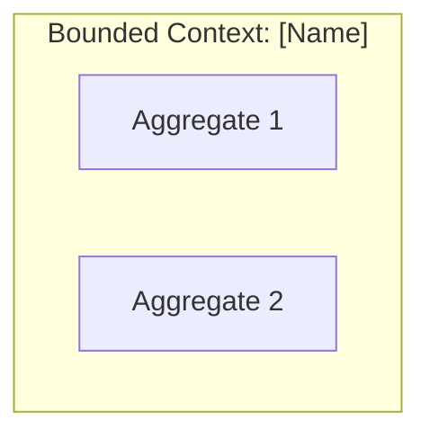
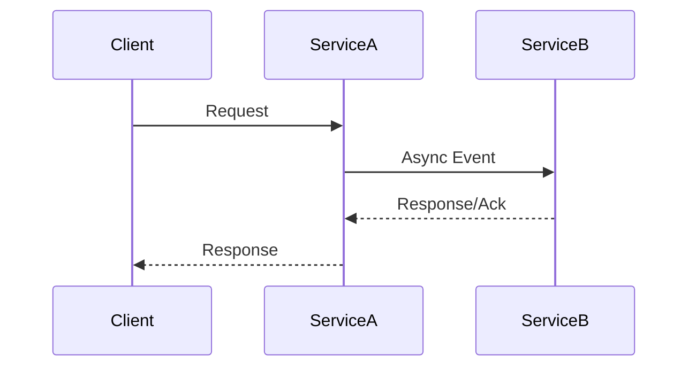
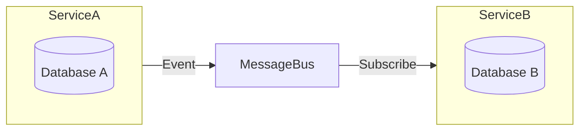
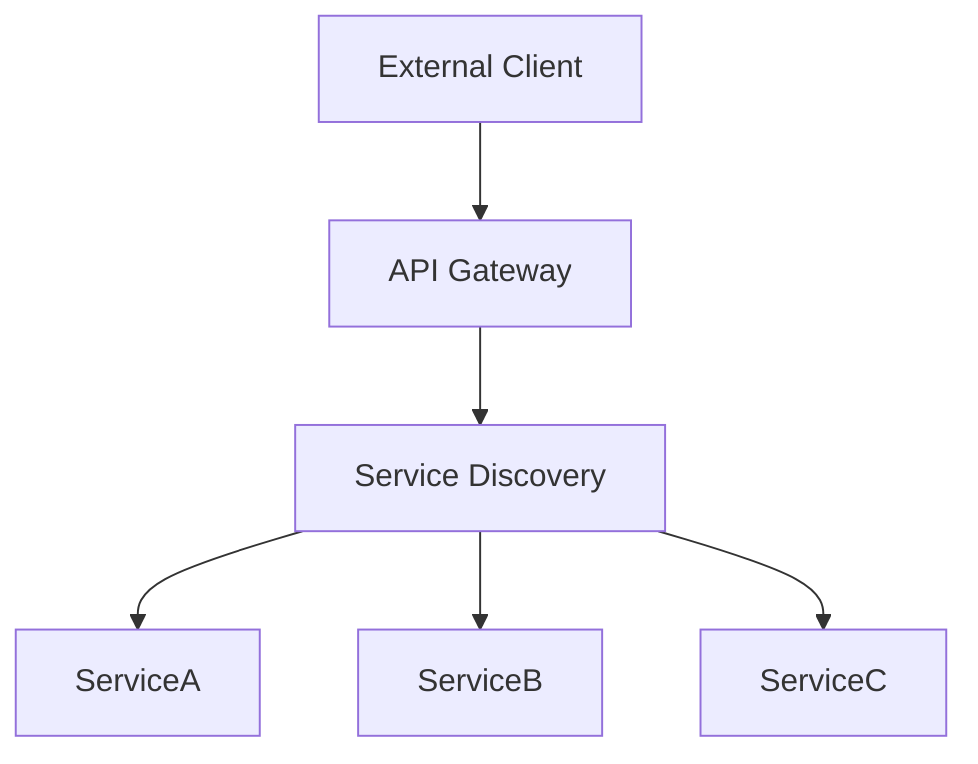
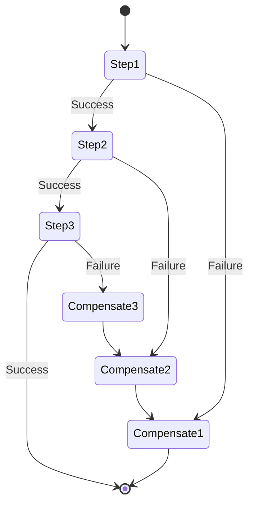
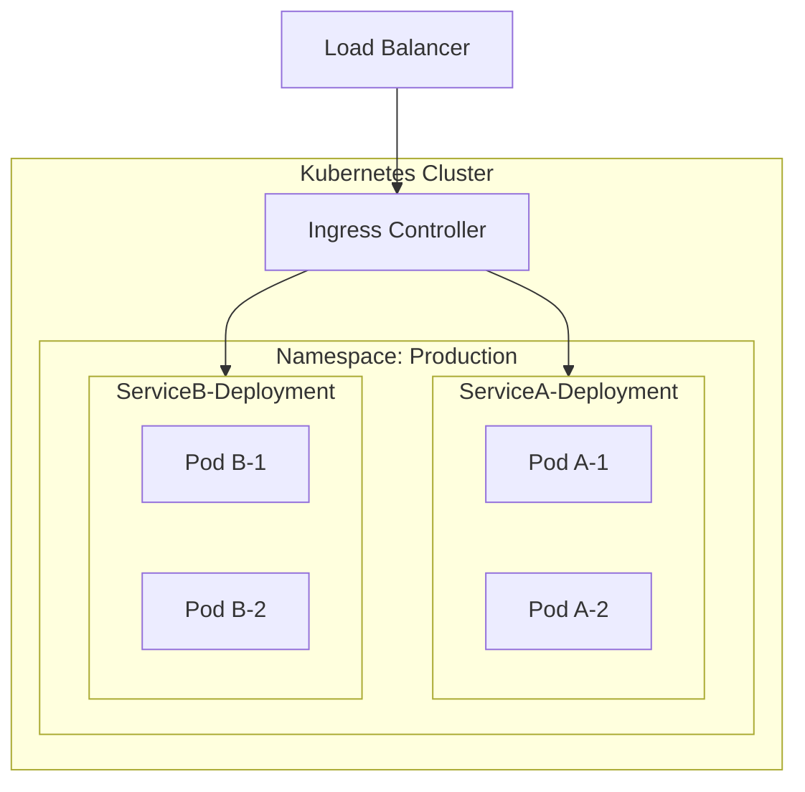
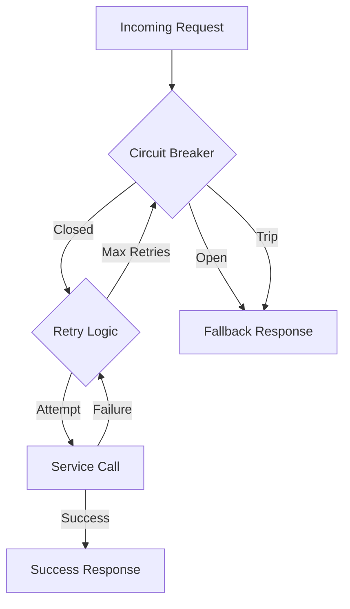

# Design Review and Improvement

Review and improve the design document for microservices architecture best practices.

## Instructions

Analyze the provided design document (or the currently open file) and provide a comprehensive review covering the following aspects. For each aspect, provide:
1. **Current State**: What the design currently addresses
2. **Gaps**: What's missing or incomplete
3. **Recommendations**: Specific improvements with examples
4. **Diagrams**: Generate Mermaid diagrams where applicable

---

## 1. Service Decomposition Strategy

### Review Criteria
- Are bounded contexts clearly defined?
- Is the single responsibility principle applied?
- Are service boundaries aligned with business capabilities?
- Is the service granularity appropriate (not too fine, not too coarse)?

### Questions to Answer
- What are the core domain entities?
- How are aggregates defined?
- Are there any shared kernels between services?
- Is there a context map showing relationships?

### Generate Diagram
Create a **Context Map** showing:
- Bounded contexts
- Upstream/downstream relationships
- Integration patterns (Shared Kernel, Customer-Supplier, Conformist, Anti-corruption Layer)



---

## 2. Service Interaction Patterns

### Review Criteria
- Are synchronous vs asynchronous patterns clearly chosen?
- Is the choice justified based on use case requirements?
- Are timeout and retry policies defined?

### Patterns to Consider
| Pattern | Use When | Trade-offs |
|---------|----------|------------|
| Request-Response (Sync) | Real-time data needed, simple queries | Tight coupling, cascading failures |
| Event-Driven (Async) | Eventual consistency OK, decoupling needed | Complexity, debugging difficulty |
| Saga | Distributed transactions | Compensation logic complexity |
| CQRS | Read/write scaling differs | Eventual consistency |

### Generate Diagram
Create a **Sequence Diagram** showing key service interactions:



---

## 3. Data Management Strategy

### Review Criteria
- Is "database per service" pattern followed?
- How is data consistency maintained across services?
- Are saga patterns defined for distributed transactions?
- Is event sourcing considered where appropriate?

### Questions to Answer
- What data does each service own?
- How are cross-service queries handled?
- What's the strategy for data replication?
- How are schema migrations handled?

### Generate Diagram
Create a **Data Flow Diagram** showing:
- Data ownership
- Replication patterns
- Event flows



---

## 4. API Gateway and Service Discovery

### Review Criteria
- Is there an API Gateway for external traffic?
- How do services discover each other?
- Is there rate limiting and throttling?
- How is API versioning handled?

### Components to Review
- [ ] API Gateway (Kong, AWS API Gateway, Nginx)
- [ ] Service Registry (Consul, etcd, Kubernetes DNS)
- [ ] Load Balancing strategy
- [ ] Circuit breaker at gateway level
- [ ] Authentication/Authorization at gateway

### Generate Diagram
Create an **Infrastructure Diagram**:



---

## 5. Inter-Service Communication

### Review Criteria
- Are protocols clearly defined (REST, gRPC, messaging)?
- Is the choice justified for each interaction?
- Are contracts/schemas versioned?
- How are breaking changes handled?

### Protocol Comparison
| Aspect | REST | gRPC | Message Queue |
|--------|------|------|---------------|
| Latency | Medium | Low | Variable |
| Coupling | Medium | Medium | Low |
| Debugging | Easy | Medium | Hard |
| Schema | OpenAPI | Protobuf | Avro/JSON |

### Questions to Answer
- What serialization format is used?
- Are there contract tests?
- How are backward-compatible changes ensured?

---

## 6. Distributed Transaction Handling

### Review Criteria
- Are distributed transactions avoided where possible?
- If needed, what pattern is used (Saga, 2PC)?
- Are compensation actions defined?
- How are partial failures handled?

### Saga Pattern Review
For each saga, document:
1. **Steps**: Sequence of local transactions
2. **Compensations**: Rollback actions for each step
3. **Orchestration**: Choreography vs Orchestration choice

### Generate Diagram
Create a **Saga Flow Diagram**:



---

## 7. Monitoring and Distributed Tracing

### Review Criteria
- Are the three pillars covered (Logs, Metrics, Traces)?
- Is there correlation ID propagation?
- Are SLIs/SLOs defined?
- Are alerts configured for critical paths?

### Components to Review
| Pillar | Tool Options | Key Metrics |
|--------|--------------|-------------|
| Logging | ELK, Loki, CloudWatch | Error rate, log volume |
| Metrics | Prometheus, Datadog | Latency, throughput, errors |
| Tracing | Jaeger, Zipkin, X-Ray | Request flow, bottlenecks |

### Questions to Answer
- How are traces propagated across services?
- What's the sampling strategy?
- Are dashboards defined for key journeys?

---

## 8. Deployment and Orchestration

### Review Criteria
- Is container orchestration defined (Kubernetes)?
- Are deployment strategies specified (rolling, blue-green, canary)?
- Is infrastructure as code used?
- Are resource limits and requests defined?

### Kubernetes Review Checklist
- [ ] Deployment manifests with resource limits
- [ ] Horizontal Pod Autoscaler (HPA) configured
- [ ] Pod Disruption Budgets (PDB) defined
- [ ] Network Policies for service isolation
- [ ] ConfigMaps/Secrets for configuration
- [ ] Health checks (liveness, readiness probes)

### Generate Diagram
Create a **Deployment Architecture Diagram**:



---

## 9. Failure Handling and Resilience Patterns

### Review Criteria
- Are circuit breakers implemented?
- Is there retry with exponential backoff?
- Are bulkheads used for isolation?
- Is there graceful degradation?

### Resilience Patterns Checklist
| Pattern | Purpose | Implementation |
|---------|---------|----------------|
| Circuit Breaker | Prevent cascade failures | Hystrix, Resilience4j |
| Retry | Handle transient failures | Exponential backoff |
| Timeout | Prevent resource exhaustion | Context deadlines |
| Bulkhead | Isolate failures | Thread pools, rate limits |
| Fallback | Graceful degradation | Default values, cache |

### Questions to Answer
- What are the failure modes?
- How long until circuit opens?
- What's the fallback behavior?
- How is partial availability handled?

### Generate Diagram
Create a **Resilience Flow Diagram**:



---

## Output Format

After reviewing the design, provide:

### 1. Executive Summary
- Overall design maturity score (1-5)
- Top 3 strengths
- Top 3 areas for improvement

### 2. Detailed Review
For each of the 9 areas above:
- Current state assessment
- Specific gaps identified
- Actionable recommendations
- Priority (High/Medium/Low)

### 3. Generated Diagrams
Include all relevant Mermaid diagrams:
- Context Map
- Service Interaction Sequence
- Data Flow
- Infrastructure
- Deployment Architecture
- Resilience Patterns

### 4. Action Items
Prioritized list of improvements with:
- Description
- Effort estimate (S/M/L)
- Impact (High/Medium/Low)
- Dependencies

---

## Usage

To use this command:
1. Open the design document you want to review
2. Run this command
3. Provide any additional context about the system

Or specify the design document path:
```
Review the design at: [path/to/design.md]
```
