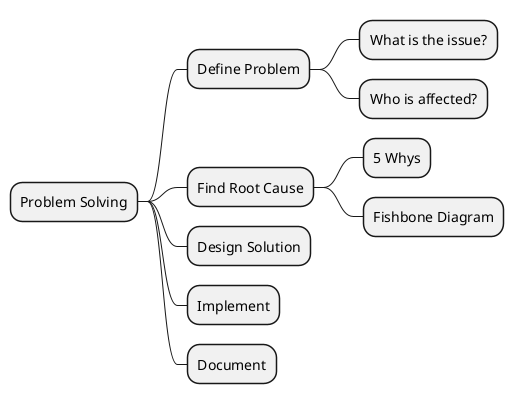
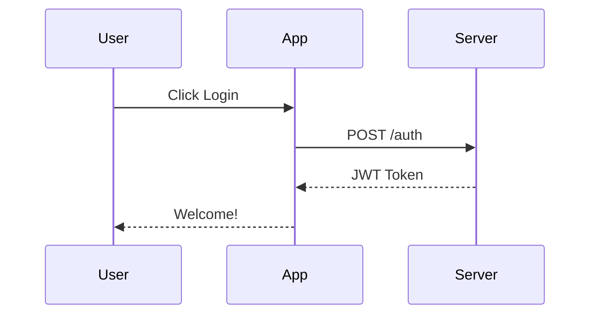

# Diagram Render Skill

A skill for rendering diagrams from code blocks (PlantUML, Mermaid, Graphviz) to PNG/SVG images.

## When to Use

Use this skill when:
- Any task requires rendering diagrams from code to images
- Processing markdown files that contain diagram code blocks
- Converting PlantUML, Mermaid, or Graphviz scripts to PNG/SVG
- Generating visual documentation from code
- Creating architecture diagrams, flowcharts, sequence diagrams, mind maps, etc.

## Supported Diagram Types

| Type | Code Block | File Extension | Description |
|------|------------|----------------|-------------|
| PlantUML | \`\`\`plantuml | `.puml` | UML diagrams, mind maps, sequence diagrams, class diagrams |
| Mermaid | \`\`\`mermaid | `.mmd` | Flowcharts, sequence diagrams, ER diagrams, Gantt charts |
| Graphviz | \`\`\`dot or \`\`\`graphviz | `.dot` | Directed/undirected graphs, network diagrams |

## Rendering Script

This skill provides a Python script `render_diagram.py` that handles all rendering tasks.

### Script Location

```
.claude/skills/diagram-render/scripts/render_diagram.py
```

### Usage

```bash
# Render PlantUML from file
python .claude/skills/diagram-render/scripts/render_diagram.py plantuml -i input.puml -o output.png

# Render from stdin
echo '@startuml
Alice -> Bob: Hello
@enduml' | python .claude/skills/diagram-render/scripts/render_diagram.py plantuml -o output.png

# Render Mermaid
python .claude/skills/diagram-render/scripts/render_diagram.py mermaid -i diagram.mmd -o output.png

# Render Graphviz
python .claude/skills/diagram-render/scripts/render_diagram.py graphviz -i graph.dot -o output.svg -f svg

# Output base64 to stdout
python .claude/skills/diagram-render/scripts/render_diagram.py plantuml -i diagram.puml --base64

# Verbose mode
python .claude/skills/diagram-render/scripts/render_diagram.py plantuml -i diagram.puml -o output.png -v
```

### CLI Arguments

| Argument | Description |
|----------|-------------|
| `type` | Diagram type: `plantuml`, `mermaid`, `graphviz`, or `dot` |
| `-i, --input` | Input file (reads from stdin if not specified) |
| `-o, --output` | Output file path |
| `-f, --format` | Output format: `png` (default) or `svg` |
| `--base64` | Output base64-encoded image to stdout |
| `-v, --verbose` | Show progress messages |

### Requirements

The script requires:

- **Python 3.9+**
- **requests** - For PlantUML public server

Optional (for local rendering):
- **graphviz** - For Graphviz (`brew install graphviz` or `pip install graphviz`)
- **mermaid-cli** - For Mermaid (`npm install -g @mermaid-js/mermaid-cli`)

### Installation

**Option 1: Using uv (recommended for standalone scripts)**

```bash
# uv automatically reads inline script dependencies and runs in isolated env
uv run .claude/skills/diagram-render/scripts/render_diagram.py --help
```

**Option 2: Using pip with requirements.txt**

```bash
pip install -r .claude/skills/diagram-render/scripts/requirements.txt
python .claude/skills/diagram-render/scripts/render_diagram.py --help
```

**Option 3: Direct pip install**

```bash
pip install requests
python .claude/skills/diagram-render/scripts/render_diagram.py --help
```

## Step-by-Step Workflow

When processing content with diagrams:

### 1. Identify Diagram Code Blocks

Scan for these patterns:
- ` ```plantuml ... ``` `
- ` ```mermaid ... ``` `
- ` ```dot ... ``` ` or ` ```graphviz ... ``` `

### 2. Extract and Save Diagram Source

For each diagram code block:

```bash
# Save to temp file
cat > /tmp/diagram.puml << 'EOF'
@startmindmap
* Main Topic
** Branch 1
** Branch 2
@endmindmap
EOF
```

### 3. Render Using the Script

```bash
# Render to PNG
python .claude/skills/diagram-render/scripts/render_diagram.py plantuml \
    -i /tmp/diagram.puml \
    -o /path/to/output/diagram.png \
    -v
```

### 4. Verify and Reference

After rendering, add an image reference if needed:

```markdown

```

## Rendering Methods (Inside the Script)

The script uses these methods internally:

### PlantUML
- Uses the public PlantUML server (https://www.plantuml.com/plantuml)
- Encodes diagram using PlantUML's custom compression format
- Configurable via `PLANTUML_SERVER` environment variable

### Graphviz
1. Tries python-graphviz library first
2. Falls back to `dot` binary if library unavailable

### Mermaid
1. Uses `mmdc` (mermaid-cli) if installed
2. Falls back to `npx @mermaid-js/mermaid-cli` if npx available

## Examples

### Example 1: Render PlantUML Mind Map

**Diagram source** (`mindmap.puml`):


**Render command**:
```bash
python .claude/skills/diagram-render/scripts/render_diagram.py plantuml \
    -i mindmap.puml \
    -o content/images/problem_solving_mindmap.png
```

### Example 2: Render Mermaid Sequence Diagram

**Diagram source** (`auth.mmd`):


**Render command**:
```bash
python .claude/skills/diagram-render/scripts/render_diagram.py mermaid \
    -i auth.mmd \
    -o content/images/auth_sequence.png
```

### Example 3: Render Graphviz Flow

**Diagram source** (`flow.dot`):


**Render command**:
```bash
python .claude/skills/diagram-render/scripts/render_diagram.py graphviz \
    -i flow.dot \
    -o content/images/flow_diagram.png
```

### Example 4: Render from Stdin

```bash
echo '@startuml
Alice -> Bob: Hello
Bob --> Alice: Hi!
@enduml' | python .claude/skills/diagram-render/scripts/render_diagram.py plantuml -o output.png
```

### Example 5: Get Base64 Output

```bash
python .claude/skills/diagram-render/scripts/render_diagram.py plantuml \
    -i diagram.puml \
    --base64 > diagram_base64.txt
```

## Integration with Blog Commands

When used with `/blog-write` or `/blog-improve`:

### Naming Convention
```
<post_filename>_<diagram_name>.png
```

Examples:
- `journal_20260201_problem_solving_mindmap.png`
- `tech_20260115_auth_sequence.png`

### Storage Location
- Images: `content/images/`

### Markdown Reference (from `content/journal/` or `content/tech/`)
```markdown

```

### Workflow for Blog Posts

1. **Detect diagram blocks** in the article
2. **Extract source** to temp file
3. **Generate filename** based on post name and diagram type
4. **Render using script**:
   ```bash
   python .claude/skills/diagram-render/scripts/render_diagram.py <type> \
       -i /tmp/diagram.<ext> \
       -o content/images/<post>_<name>.png
   ```
5. **Add image reference** below the code block
6. **Keep code block** as source (do not remove)

## Error Handling

### Common Errors and Solutions

**"requests package required"**
```bash
pip install requests
```

**"Graphviz not available"**
```bash
# macOS
brew install graphviz

# Ubuntu
apt install graphviz

# Python library
pip install graphviz
```

**"mermaid-cli (mmdc) not found"**
```bash
npm install -g @mermaid-js/mermaid-cli
```

**"SSL verification failed"**
The script will automatically retry without SSL verification and show a warning. To fix properly:
- Update system CA certificates
- Set `PLANTUML_SERVER` to a local server

**"dot failed" or "mmdc failed"**
Usually indicates syntax error in the diagram source. Check the error message for details.

## Environment Variables

| Variable | Default | Description |
|----------|---------|-------------|
| `PLANTUML_SERVER` | `https://www.plantuml.com/plantuml` | PlantUML server URL |

## Tips

1. **Always keep source code blocks** - The rendered image may need updates; keeping source enables re-rendering

2. **Use meaningful diagram names** - `auth_sequence.png` is better than `diagram1.png`

3. **Prefer PNG for complex diagrams** - PNG preserves details better for diagrams with lots of elements

4. **Use SVG for scalable output** - SVG is better for documentation that may be viewed at different sizes

5. **Test locally first** - Render a simple diagram to verify your environment is set up correctly

## Troubleshooting

### Script Not Found
Make sure you're running from the workspace root:
```bash
cd /Users/walter.fan/workspace/walter/wfblog
python .claude/skills/diagram-render/scripts/render_diagram.py --help
```

### Permission Denied
Make the script executable:
```bash
chmod +x .claude/skills/diagram-render/scripts/render_diagram.py
```

### Network Issues
If PlantUML server is unreachable, set up a local server:
```bash
docker run -d -p 8080:8080 plantuml/plantuml-server:jetty
export PLANTUML_SERVER=http://localhost:8080
```
