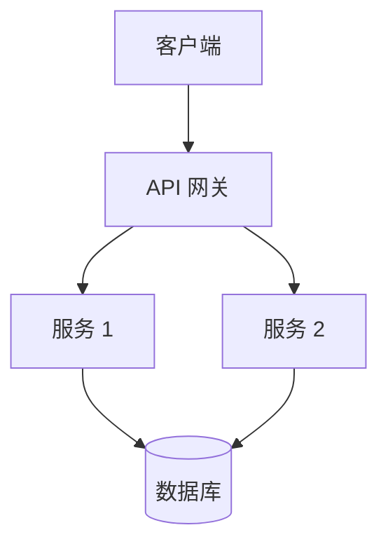
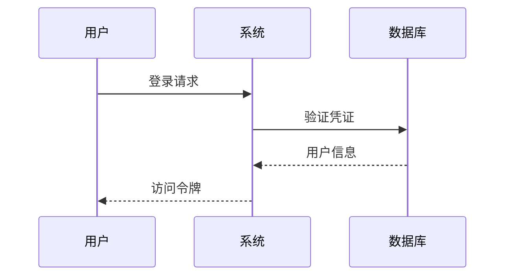
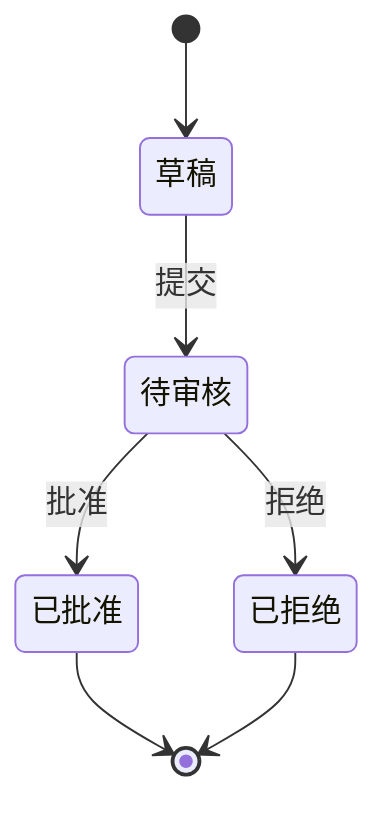
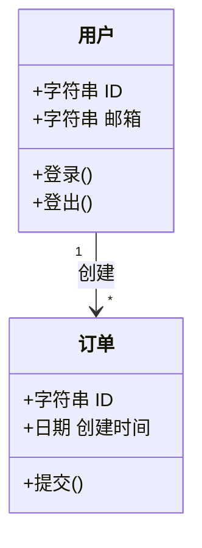

# PKP 图表示例速查

## 架构图

### 系统架构

### 时序图

### 状态图

### 类图

## 快速参考

| 图表类型 | 关键字 | 用途 |
|---------|-------|------|
| 流程图 | `flowchart` | 流程、决策 |
| 时序图 | `sequenceDiagram` | API 调用、交互 |
| 状态图 | `stateDiagram-v2` | 状态转换 |
| 类图 | `classDiagram` | 类关系、继承 |
| ER 图 | `erDiagram` | 数据模型 |
| 甘特图 | `gantt` | 项目计划 |

更多示例参见 [diagrams-guide.md](templates/docs/diagrams-guide.md)
