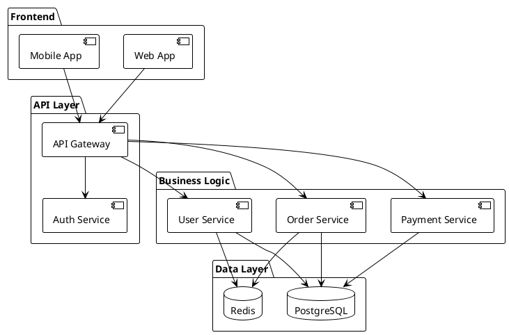
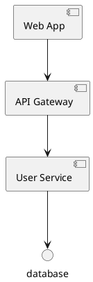
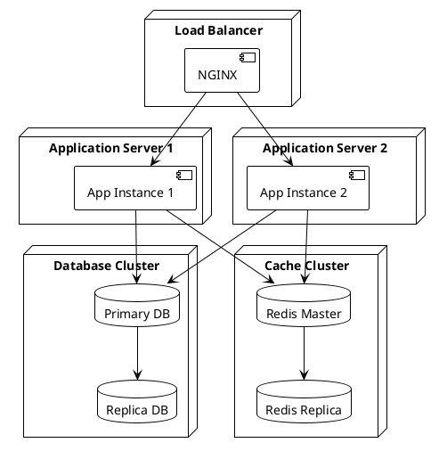
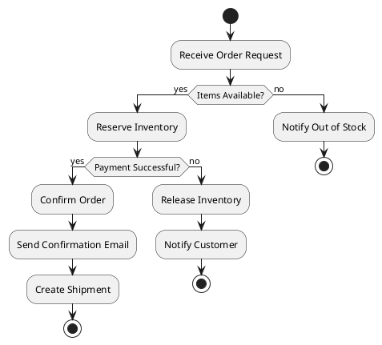

# Diagram Guide

This guide demonstrates how to create various types of diagrams in the Project Knowledge Pack documentation using Mermaid and PlantUML.

## Mermaid Diagrams (Recommended)

Mermaid is the preferred diagramming tool for PKP documentation. It supports a wide variety of diagram types and renders directly in the browser.

### Flowcharts

```{mermaid}
flowchart TD
    Start([Start]) --> Input[/User Input/]
    Input --> Process[Process Data]
    Process --> Decision{Valid?}
    Decision -->|Yes| Success[Success]
    Decision -->|No| Error[Error]
    Error --> Input
    Success --> End([End])

    style Start fill:#e1f5ff
    style Success fill:#c8e6c9
    style Error fill:#ffcdd2
    style End fill:#e1f5ff
```

**Code**:
````markdown
```{mermaid}
flowchart TD
    Start([Start]) --> Input[/User Input/]
    Input --> Process[Process Data]
    Process --> Decision{Valid?}
    Decision -->|Yes| Success[Success]
    Decision -->|No| Error[Error]
    Error --> Input
    Success --> End([End])
```
````

### Sequence Diagrams

```{mermaid}
sequenceDiagram
    participant Client
    participant API
    participant Service
    participant DB

    Client->>API: Request
    activate API

    API->>Service: Process
    activate Service

    Service->>DB: Query
    activate DB
    DB-->>Service: Result
    deactivate DB

    Service-->>API: Response
    deactivate Service

    API-->>Client: Response
    deactivate API
```

**Code**:
````markdown
```{mermaid}
sequenceDiagram
    participant Client
    participant API
    participant Service
    participant DB

    Client->>API: Request
    API->>Service: Process
    Service->>DB: Query
    DB-->>Service: Result
    Service-->>API: Response
    API-->>Client: Response
```
````

### Class Diagrams

```{mermaid}
classDiagram
    class User {
        +String id
        +String email
        +String name
        +login()
        +logout()
    }

    class Order {
        +String id
        +Date createdAt
        +Float total
        +String status
        +submit()
        +cancel()
    }

    class OrderItem {
        +String id
        +String productId
        +Integer quantity
        +Float price
    }

    User "1" --> "*" Order : places
    Order "1" --> "*" OrderItem : contains

    class Payment {
        +String id
        +String method
        +Float amount
        +String status
        +process()
        +refund()
    }

    Order "1" --> "1" Payment : paid by
```

**Code**:
````markdown
```{mermaid}
classDiagram
    class User {
        +String id
        +String email
        +login()
    }
    class Order {
        +String id
        +submit()
    }
    User "1" --> "*" Order : places
```
````

### State Diagrams

```{mermaid}
stateDiagram-v2
    [*] --> Draft
    Draft --> Submitted: submit()

    Submitted --> Approved: approve()
    Submitted --> Rejected: reject()

    Approved --> Published: publish()
    Published --> Archived: archive()

    Rejected --> Draft: revise()

    Archived --> [*]
    Rejected --> [*]

    note right of Submitted
        Waiting for review
        Auto-reject after 7 days
    end note

    note right of Published
        Visible to all users
        Cannot be edited
    end note
```

**Code**:
````markdown
```{mermaid}
stateDiagram-v2
    [*] --> Draft
    Draft --> Submitted: submit()
    Submitted --> Approved: approve()
    Submitted --> Rejected: reject()
```
````

### Entity Relationship Diagrams

```{mermaid}
erDiagram
    USER ||--o{ ORDER : places
    ORDER ||--|{ ORDER_ITEM : contains
    PRODUCT ||--o{ ORDER_ITEM : "ordered in"
    ORDER ||--|| PAYMENT : "paid with"

    USER {
        uuid id PK
        string email UK
        string name
        timestamp created_at
    }

    ORDER {
        uuid id PK
        uuid user_id FK
        float total
        string status
        timestamp created_at
    }

    ORDER_ITEM {
        uuid id PK
        uuid order_id FK
        uuid product_id FK
        int quantity
        float price
    }

    PRODUCT {
        uuid id PK
        string name
        string sku UK
        float price
        int stock
    }

    PAYMENT {
        uuid id PK
        uuid order_id FK
        string method
        float amount
        string status
    }
```

**Code**:
````markdown
```{mermaid}
erDiagram
    USER ||--o{ ORDER : places
    ORDER ||--|{ ORDER_ITEM : contains

    USER {
        uuid id PK
        string email
    }
```
````

### Gantt Charts

```{mermaid}
gantt
    title Project Timeline
    dateFormat YYYY-MM-DD
    section Planning
        Requirements     :done, req, 2026-01-01, 2026-01-15
        Design          :done, des, 2026-01-10, 2026-01-25
    section Development
        Backend         :active, dev1, 2026-01-20, 2026-02-20
        Frontend        :dev2, 2026-02-01, 2026-02-28
        Integration     :dev3, 2026-02-15, 2026-03-05
    section Testing
        Unit Tests      :test1, 2026-02-01, 2026-02-20
        Integration     :test2, 2026-02-25, 2026-03-10
    section Deployment
        Staging         :deploy1, 2026-03-05, 2026-03-12
        Production      :deploy2, 2026-03-12, 2026-03-15
```

### Pie Charts

```{mermaid}
pie title Technology Stack Distribution
    "Go" : 45
    "TypeScript" : 30
    "Python" : 15
    "SQL" : 7
    "Shell" : 3
```

### Git Graphs

```{mermaid}
gitgraph
    commit id: "Initial commit"
    commit id: "Add user model"
    branch feature/authentication
    checkout feature/authentication
    commit id: "Add JWT support"
    commit id: "Add login endpoint"
    checkout main
    merge feature/authentication
    commit id: "Update README"
    branch feature/orders
    checkout feature/orders
    commit id: "Add order model"
    commit id: "Add order API"
    checkout main
    merge feature/orders
    commit id: "Release v1.0"
```

### Journey Diagrams

```{mermaid}
journey
    title User Registration Journey
    section Sign Up
        Visit homepage: 5: User
        Click sign up: 4: User
        Fill form: 3: User
        Submit: 4: User
    section Verification
        Check email: 3: User
        Click verification link: 5: User
        Account activated: 5: User, System
    section Onboarding
        Complete profile: 4: User
        Set preferences: 3: User
        Start using: 5: User
```

## PlantUML Diagrams (Alternative)

PlantUML can be used when Mermaid doesn't support a specific diagram type, or when you need more advanced features.

### Component Diagram



**Code**:
````markdown

````

### Deployment Diagram



### Activity Diagram



## Diagram Best Practices

### 1. Choose the Right Diagram Type

| Use Case | Diagram Type |
|----------|--------------|
| API call flow | Sequence Diagram |
| System components | Component/Architecture Diagram |
| Data model | Entity Relationship Diagram |
| Process flow | Flowchart |
| State transitions | State Diagram |
| Project timeline | Gantt Chart |
| Class hierarchy | Class Diagram |

### 2. Keep Diagrams Simple

- Focus on one concept per diagram
- Limit to 7-10 main elements
- Use sub-diagrams for complex systems
- Add notes for clarification

### 3. Use Consistent Styling

```{mermaid}
flowchart LR
    Start[Start State]
    Process[Process]
    Success[Success State]
    Error[Error State]

    Start --> Process
    Process --> Success
    Process --> Error

    style Start fill:#e1f5ff,stroke:#01579b
    style Process fill:#fff3e0,stroke:#e65100
    style Success fill:#c8e6c9,stroke:#1b5e20
    style Error fill:#ffcdd2,stroke:#b71c1c
```

**Color Scheme**:
- 🔵 Start/End: Light blue (#e1f5ff)
- 🟡 Process: Light orange (#fff3e0)
- 🟢 Success: Light green (#c8e6c9)
- 🔴 Error: Light red (#ffcdd2)

### 4. Add Meaningful Labels

**Bad**:
```{mermaid}
graph LR
    A --> B --> C
```

**Good**:
```{mermaid}
graph LR
    User[User] -->|Login Request| API[API Gateway]
    API -->|Validated| Service[Auth Service]
```

### 5. Include Annotations

```{mermaid}
sequenceDiagram
    participant User
    participant API
    participant DB

    User->>API: GET /users/123

    Note right of API: Check authentication<br/>and permissions

    API->>DB: SELECT * FROM users<br/>WHERE id = 123
    DB-->>API: User data

    Note over API,DB: Data is cached<br/>for 5 minutes

    API-->>User: 200 OK
```

## Diagram Templates

### API Endpoint Flow Template

````markdown
```{mermaid}
sequenceDiagram
    participant Client
    participant API
    participant Service
    participant DB

    Client->>API: [METHOD] [ENDPOINT]
    API->>API: Validate Request

    alt Validation Failed
        API-->>Client: 400 Bad Request
    else Validation Passed
        API->>Service: [ServiceMethod]
        Service->>DB: [Query]
        DB-->>Service: [Result]
        Service-->>API: [Response]
        API-->>Client: 200 OK
    end
```
````

### Microservice Interaction Template

````markdown
```{mermaid}
graph TB
    subgraph "Service A"
        A1[API]
        A2[Business Logic]
        A3[Database]
    end

    subgraph "Service B"
        B1[API]
        B2[Business Logic]
        B3[Database]
    end

    Client --> A1
    A1 --> A2
    A2 --> A3
    A2 --> B1
    B1 --> B2
    B2 --> B3
```
````

### Error Handling Flow Template

````markdown
```{mermaid}
flowchart TD
    Start([Start]) --> Try[Try Operation]
    Try --> Check{Success?}
    Check -->|Yes| Success[Return Success]
    Check -->|No| Retry{Retryable?}
    Retry -->|Yes| Wait[Wait + Backoff]
    Wait --> Try
    Retry -->|No| Error[Return Error]
    Success --> End([End])
    Error --> End
```
````

## Troubleshooting

### Mermaid Not Rendering

1. Check syntax: https://mermaid.js.org/intro/
2. Verify extension is enabled in `conf.py`
3. Clear Sphinx cache: `make clean`
4. Rebuild: `make html`

### PlantUML Not Rendering

1. Install PlantUML: `brew install plantuml` (macOS)
2. Or use PlantUML server: Set `plantuml_server_url` in `conf.py`
3. Verify Java is installed: `java -version`

## Resources

- [Mermaid Documentation](https://mermaid.js.org/)
- [Mermaid Live Editor](https://mermaid.live/)
- [PlantUML Documentation](https://plantuml.com/)
- [PlantUML Online Editor](http://www.plantuml.com/plantuml/)

---

**Last Updated**: 2026-02-18
**Version**: 1.0
