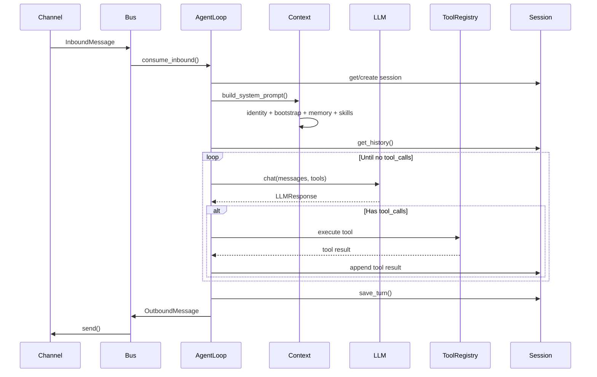
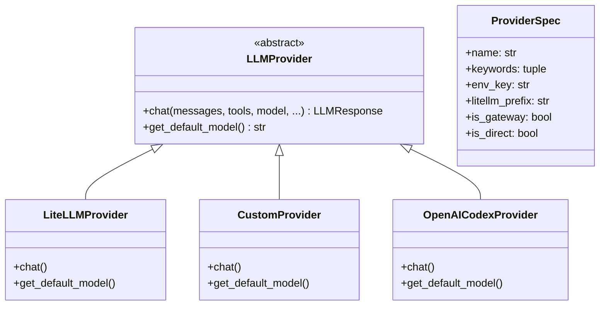

# Architecture

## System Overview

nanobot is an event-driven, single-process AI assistant built around an async message bus. Chat channels produce inbound messages, the agent loop consumes them, calls LLMs with tool definitions, executes tool calls, and sends responses back through channels. The entire system runs in a single Python asyncio event loop.

### High-Level Architecture

```mermaid
graph TB
    subgraph "Chat Channels"
        Telegram[Telegram]
        Discord[Discord]
        Slack[Slack]
        WhatsApp[WhatsApp]
        Feishu[Feishu]
        DingTalk[DingTalk]
        QQ[QQ]
        Email[Email]
        Matrix[Matrix]
        Mochat[Mochat]
    end

    subgraph "Message Bus"
        InQ[Inbound Queue]
        OutQ[Outbound Queue]
    end

    subgraph "Agent Core"
        Loop[Agent Loop]
        Context[Context Builder]
        Memory[Memory Store]
        Skills[Skills Loader]
        Tools[Tool Registry]
        Session[Session Manager]
    end

    subgraph "Tools"
        FS[File System]
        Shell[Shell Exec]
        Web[Web Search/Fetch]
        Cron[Cron Scheduler]
        Spawn[Subagent Spawn]
        MCP[MCP Bridge]
        Msg[Message Tool]
    end

    subgraph "LLM Providers"
        LiteLLM[LiteLLM Provider]
        Custom[Custom Provider]
        Codex[Codex Provider]
    end

    subgraph "External LLMs"
        OpenRouter[OpenRouter]
        Anthropic[Anthropic]
        OpenAI[OpenAI]
        DeepSeek[DeepSeek]
        Gemini[Gemini]
        Others[Others...]
    end

    Telegram & Discord & Slack & WhatsApp & Feishu & DingTalk & QQ & Email & Matrix & Mochat --> InQ
    InQ --> Loop
    Loop --> Context
    Context --> Memory
    Context --> Skills
    Loop --> Session
    Loop --> Tools
    Tools --> FS & Shell & Web & Cron & Spawn & MCP & Msg
    Loop --> LiteLLM & Custom & Codex
    LiteLLM --> OpenRouter & Anthropic & OpenAI & DeepSeek & Gemini & Others
    Loop --> OutQ
    OutQ --> Telegram & Discord & Slack & WhatsApp & Feishu & DingTalk & QQ & Email & Matrix & Mochat

    style Loop fill:#e8f5e9
    style InQ fill:#e3f2fd
    style OutQ fill:#e3f2fd
```

## Component Architecture

### 1. Message Bus (`nanobot/bus/`)

The `MessageBus` is the central decoupling mechanism. It uses two `asyncio.Queue` instances:

- **Inbound queue**: Channels push `InboundMessage` → Agent consumes
- **Outbound queue**: Agent pushes `OutboundMessage` → ChannelManager dispatches to the correct channel

**Key design decision**: The bus is fully async and non-blocking. Channels and the agent loop run as independent asyncio tasks, communicating only through queues.

**Files**:
- `nanobot/bus/queue.py:MessageBus` — Queue wrapper
- `nanobot/bus/events.py` — `InboundMessage`, `OutboundMessage` dataclasses

### 2. Channels (`nanobot/channels/`)

Each channel is a subclass of `BaseChannel` (`nanobot/channels/base.py`) and implements three methods:
- `start()` — Connect to the platform and listen for messages
- `stop()` — Disconnect and clean up
- `send(msg)` — Deliver an outbound message

The `ChannelManager` (`nanobot/channels/manager.py`) initializes all enabled channels from config, starts them as asyncio tasks, and dispatches outbound messages by matching `msg.channel` to the correct channel instance.

**Access control**: Each channel enforces an `allowFrom` whitelist. The `is_allowed(sender_id)` method in `BaseChannel` checks the whitelist before forwarding messages to the bus.

| Channel | Protocol | Auth Method |
|---------|----------|-------------|
| Telegram | HTTP long-poll | Bot token |
| Discord | WebSocket gateway | Bot token |
| Slack | Socket Mode (WebSocket) | Bot + App tokens |
| WhatsApp | WebSocket (Node.js bridge) | QR code scan |
| Feishu | WebSocket long connection | App ID + Secret |
| DingTalk | Stream Mode | Client ID + Secret |
| QQ | WebSocket (botpy) | App ID + Secret |
| Email | IMAP poll + SMTP send | Username + Password |
| Matrix | Matrix sync API | Access token |
| Mochat | Socket.IO | Claw token |

### 3. Agent Loop (`nanobot/agent/loop.py`)

The `AgentLoop` class is the core processing engine. Its main loop:

1. **Consume** an `InboundMessage` from the bus
2. **Load/create** a `Session` keyed by `channel:chat_id`
3. **Build context** via `ContextBuilder` — assembles the system prompt from identity, bootstrap files (`AGENTS.md`, `SOUL.md`, `USER.md`, etc.), memory, and skills
4. **Call LLM** via `LLMProvider.chat()` with message history and tool schemas
5. **Execute tools** if the `LLMResponse` contains `tool_calls` — dispatch to `ToolRegistry`
6. **Loop** back to step 4 if tool results need further LLM processing
7. **Publish** the final `OutboundMessage` to the bus

### 4. Context Builder (`nanobot/agent/context.py`)

The `ContextBuilder` assembles the system prompt by concatenating:

1. **Identity** — A built-in persona description
2. **Bootstrap files** — User-customizable files in the workspace: `AGENTS.md`, `SOUL.md`, `USER.md`, `TOOLS.md`, `IDENTITY.md`
3. **Memory** — Consolidated memory from `MemoryStore`
4. **Always-on skills** — Skills configured to always load
5. **Skills summary** — Brief descriptions of available skills so the LLM knows what it can activate via `read_file`
6. **Runtime context** — Current date/time, platform info

### 5. Provider System (`nanobot/providers/`)

The provider system uses a **Registry pattern** (`nanobot/providers/registry.py`):

- `ProviderSpec` is a frozen dataclass describing each provider's metadata (name, keywords, env vars, LiteLLM prefix, etc.)
- The `PROVIDERS` tuple is the single source of truth — ordering controls match priority
- Three provider implementations:
  - `LiteLLMProvider` — Routes through LiteLLM for broad model support
  - `CustomProvider` — Direct OpenAI-compatible HTTP calls (bypasses LiteLLM)
  - `OpenAICodexProvider` — OAuth-based authentication flow

### 6. Tool System (`nanobot/agent/tools/`)

All tools inherit from the `Tool` ABC (`nanobot/agent/tools/base.py`):

| Tool | File | Description |
|------|------|-------------|
| `read_file` | `filesystem.py` | Read file contents |
| `write_file` | `filesystem.py` | Write/create files |
| `edit_file` | `filesystem.py` | Patch files with search/replace |
| `list_dir` | `filesystem.py` | List directory contents |
| `exec` | `shell.py` | Execute shell commands |
| `web_search` | `web.py` | Search the web (Brave API) |
| `web_fetch` | `web.py` | Fetch and extract web page content |
| `message_user` | `message.py` | Send a message back to the user |
| `spawn` | `spawn.py` | Launch a background subagent |
| `cron` | `cron.py` | Manage scheduled tasks |
| MCP tools | `mcp.py` | Dynamic tools from MCP servers |

The `ToolRegistry` (`nanobot/agent/tools/registry.py`) collects all tool instances and provides:
- `get_schemas()` — Returns OpenAI-format function schemas for the LLM
- `execute(name, params)` — Dispatches to the correct tool

Tool parameters are validated against JSON Schema before execution via `Tool.validate_params()`.

### 7. Session Management (`nanobot/session/`)

Sessions are keyed by `channel:chat_id`. Each session:
- Stores messages as a `list[dict]` (append-only for LLM cache efficiency)
- Persists to disk as JSONL files in `~/.nanobot/sessions/`
- Supports history consolidation: after a threshold, older messages are summarized into `HISTORY.md` and `MEMORY.md`
- Returns only unconsolidated messages via `get_history()`, aligned to user turns to avoid orphaned tool results

### 8. Skills System (`nanobot/agent/skills.py`)

Skills are Markdown-based capability descriptions stored as `SKILL.md` files:
- **Bundled skills**: `nanobot/skills/` (weather, github, tmux, cron, etc.)
- **User skills**: `~/.nanobot/workspace/skills/`

The `SkillsLoader` scans both directories, builds a summary for the system prompt, and loads full skill content on demand when the LLM reads the SKILL.md file via the `read_file` tool.

### 9. Heartbeat & Cron

- **HeartbeatService** (`nanobot/heartbeat/service.py`): Wakes up every 30 minutes, reads `~/.nanobot/workspace/HEARTBEAT.md`, and asks the LLM whether tasks should be executed
- **CronService** (`nanobot/cron/service.py`): Uses `croniter` for precise cron-expression scheduling; the `cron` tool lets the LLM manage scheduled tasks

## Cross-Cutting Concerns

### Error Handling

The agent loop catches exceptions during tool execution and returns error messages to the LLM as tool results, allowing the LLM to recover or inform the user. Provider errors (API failures, rate limits) are logged and propagated as user-facing error messages.

### Logging

nanobot uses **loguru** for all logging. Logs go to stderr by default; the `--logs` flag in CLI mode shows them alongside chat output.

### Security

- **Workspace sandboxing**: `tools.restrictToWorkspace` limits all file/shell tools to the workspace directory
- **Channel access control**: `allowFrom` per channel, checked in `BaseChannel.is_allowed()`
- **Session isolation**: Sessions are keyed by `channel:chat_id` — no cross-conversation leakage
- **MCP tool timeout**: Configurable `toolTimeout` (default 30s) prevents hung MCP servers from blocking the agent

### Configuration

Single `Config` Pydantic model (`nanobot/config/schema.py`) validates all configuration:
- Accepts both **camelCase** and **snake_case** keys (via `alias_generator=to_camel`)
- Nested models: `ProvidersConfig`, `ChannelsConfig`, `AgentsConfig`, `ToolsConfig`
- Loaded from `~/.nanobot/config.json` with sensible defaults

## Related Documentation

- [Repository Map](01-repo-map.md) — Code structure and file locations
- [Workflows](03-workflows.md) — Key operational flows

---

**Last Updated**: 2026-03-15
**Version**: 1.0
