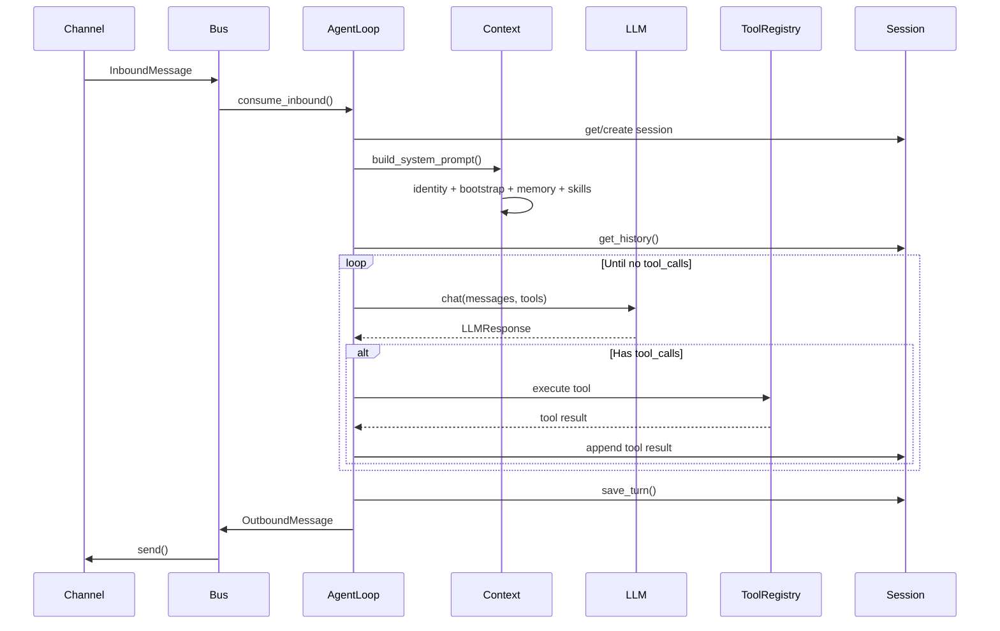
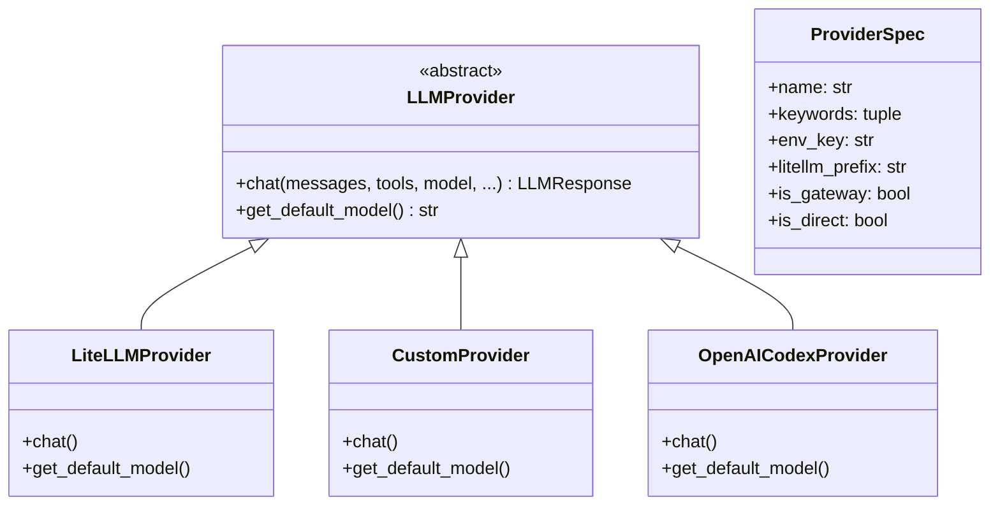

# 架构

## 系统概览

nanobot 是一个事件驱动的单进程 AI 助手，围绕异步消息总线构建。聊天频道产生入站消息，Agent 循环消费这些消息，携带工具定义调用 LLM，执行工具调用，并通过频道将响应发送回去。整个系统运行在单个 Python asyncio 事件循环中。

### 高层架构

```mermaid
graph TB
    subgraph "Chat Channels"
        Telegram[Telegram]
        Discord[Discord]
        Slack[Slack]
        WhatsApp[WhatsApp]
        Feishu[Feishu]
        DingTalk[DingTalk]
        QQ[QQ]
        Email[Email]
        Matrix[Matrix]
        Mochat[Mochat]
    end

    subgraph "Message Bus"
        InQ[Inbound Queue]
        OutQ[Outbound Queue]
    end

    subgraph "Agent Core"
        Loop[Agent Loop]
        Context[Context Builder]
        Memory[Memory Store]
        Skills[Skills Loader]
        Tools[Tool Registry]
        Session[Session Manager]
    end

    subgraph "Tools"
        FS[File System]
        Shell[Shell Exec]
        Web[Web Search/Fetch]
        Cron[Cron Scheduler]
        Spawn[Subagent Spawn]
        MCP[MCP Bridge]
        Msg[Message Tool]
    end

    subgraph "LLM Providers"
        LiteLLM[LiteLLM Provider]
        Custom[Custom Provider]
        Codex[Codex Provider]
    end

    subgraph "External LLMs"
        OpenRouter[OpenRouter]
        Anthropic[Anthropic]
        OpenAI[OpenAI]
        DeepSeek[DeepSeek]
        Gemini[Gemini]
        Others[Others...]
    end

    Telegram & Discord & Slack & WhatsApp & Feishu & DingTalk & QQ & Email & Matrix & Mochat --> InQ
    InQ --> Loop
    Loop --> Context
    Context --> Memory
    Context --> Skills
    Loop --> Session
    Loop --> Tools
    Tools --> FS & Shell & Web & Cron & Spawn & MCP & Msg
    Loop --> LiteLLM & Custom & Codex
    LiteLLM --> OpenRouter & Anthropic & OpenAI & DeepSeek & Gemini & Others
    Loop --> OutQ
    OutQ --> Telegram & Discord & Slack & WhatsApp & Feishu & DingTalk & QQ & Email & Matrix & Mochat

    style Loop fill:#e8f5e9
    style InQ fill:#e3f2fd
    style OutQ fill:#e3f2fd
```

## 组件架构

### 1. 消息总线 (`nanobot/bus/`)

`MessageBus` 是核心的解耦机制，使用两个 `asyncio.Queue` 实例：

- **入站队列**：频道推送 `InboundMessage` → Agent 消费
- **出站队列**：Agent 推送 `OutboundMessage` → ChannelManager 分发到对应频道

**关键设计决策**：总线完全异步且非阻塞。频道和 Agent 循环作为独立的 asyncio 任务运行，仅通过队列通信。

**文件**：
- `nanobot/bus/queue.py:MessageBus` — 队列封装
- `nanobot/bus/events.py` — `InboundMessage`、`OutboundMessage` 数据类

### 2. 频道 (`nanobot/channels/`)

每个频道都是 `BaseChannel`（`nanobot/channels/base.py`）的子类，需实现三个方法：
- `start()` — 连接平台并监听消息
- `stop()` — 断开连接并清理资源
- `send(msg)` — 投递出站消息

`ChannelManager`（`nanobot/channels/manager.py`）根据配置初始化所有已启用的频道，以 asyncio 任务启动它们，并通过匹配 `msg.channel` 将出站消息分发到对应的频道实例。

**访问控制**：每个频道强制执行 `allowFrom` 白名单。`BaseChannel` 中的 `is_allowed(sender_id)` 方法在将消息转发到总线之前检查白名单。

| 频道 | 协议 | 认证方式 |
|---------|----------|-------------|
| Telegram | HTTP long-poll | Bot token |
| Discord | WebSocket gateway | Bot token |
| Slack | Socket Mode (WebSocket) | Bot + App tokens |
| WhatsApp | WebSocket (Node.js bridge) | 扫描二维码 |
| Feishu | WebSocket 长连接 | App ID + Secret |
| DingTalk | Stream Mode | Client ID + Secret |
| QQ | WebSocket (botpy) | App ID + Secret |
| Email | IMAP 轮询 + SMTP 发送 | 用户名 + 密码 |
| Matrix | Matrix sync API | Access token |
| Mochat | Socket.IO | Claw token |

### 3. Agent 循环 (`nanobot/agent/loop.py`)

`AgentLoop` 类是核心处理引擎。其主循环流程如下：

1. 从总线**消费**一条 `InboundMessage`
2. 以 `channel:chat_id` 为键**加载/创建** `Session`
3. 通过 `ContextBuilder` **构建上下文** — 从身份信息、引导文件（`AGENTS.md`、`SOUL.md`、`USER.md` 等）、记忆和技能中组装系统提示词
4. 通过 `LLMProvider.chat()` **调用 LLM**，传入消息历史和工具 schema
5. 如果 `LLMResponse` 包含 `tool_calls`，则**执行工具** — 分发到 `ToolRegistry`
6. 如果工具结果需要 LLM 进一步处理，则**循环**回到第 4 步
7. 将最终的 `OutboundMessage` **发布**到总线

### 4. 上下文构建器 (`nanobot/agent/context.py`)

`ContextBuilder` 通过拼接以下内容来组装系统提示词：

1. **身份信息** — 内置的角色描述
2. **引导文件** — 工作区中用户可自定义的文件：`AGENTS.md`、`SOUL.md`、`USER.md`、`TOOLS.md`、`IDENTITY.md`
3. **记忆** — 来自 `MemoryStore` 的整合记忆
4. **常驻技能** — 配置为始终加载的技能
5. **技能摘要** — 可用技能的简要描述，让 LLM 知道可以通过 `read_file` 激活哪些技能
6. **运行时上下文** — 当前日期/时间、平台信息

### 5. Provider 系统 (`nanobot/providers/`)

Provider 系统采用**注册表模式**（`nanobot/providers/registry.py`）：

- `ProviderSpec` 是一个冻结的数据类，描述每个 provider 的元数据（名称、关键词、环境变量、LiteLLM 前缀等）
- `PROVIDERS` 元组是唯一的事实来源 — 排列顺序决定匹配优先级
- 三种 provider 实现：
  - `LiteLLMProvider` — 通过 LiteLLM 路由，支持广泛的模型
  - `CustomProvider` — 直接发起 OpenAI 兼容的 HTTP 调用（绕过 LiteLLM）
  - `OpenAICodexProvider` — 基于 OAuth 的认证流程

### 6. 工具系统 (`nanobot/agent/tools/`)

所有工具继承自 `Tool` 抽象基类（`nanobot/agent/tools/base.py`）：

| 工具 | 文件 | 描述 |
|------|------|-------------|
| `read_file` | `filesystem.py` | 读取文件内容 |
| `write_file` | `filesystem.py` | 写入/创建文件 |
| `edit_file` | `filesystem.py` | 通过搜索/替换修补文件 |
| `list_dir` | `filesystem.py` | 列出目录内容 |
| `exec` | `shell.py` | 执行 shell 命令 |
| `web_search` | `web.py` | 搜索网页（Brave API） |
| `web_fetch` | `web.py` | 抓取并提取网页内容 |
| `message_user` | `message.py` | 向用户发送消息 |
| `spawn` | `spawn.py` | 启动后台子 Agent |
| `cron` | `cron.py` | 管理定时任务 |
| MCP tools | `mcp.py` | 来自 MCP 服务器的动态工具 |

`ToolRegistry`（`nanobot/agent/tools/registry.py`）收集所有工具实例并提供：
- `get_schemas()` — 返回 OpenAI 格式的函数 schema 供 LLM 使用
- `execute(name, params)` — 分发到对应的工具

工具参数在执行前通过 `Tool.validate_params()` 按 JSON Schema 进行校验。

### 7. 会话管理 (`nanobot/session/`)

会话以 `channel:chat_id` 为键。每个会话：
- 以 `list[dict]` 存储消息（仅追加，以提高 LLM 缓存效率）
- 以 JSONL 文件持久化到 `~/.nanobot/sessions/` 目录
- 支持历史整合：超过阈值后，较早的消息会被摘要到 `HISTORY.md` 和 `MEMORY.md` 中
- 通过 `get_history()` 仅返回未整合的消息，并对齐到用户轮次以避免孤立的工具结果

### 8. 技能系统 (`nanobot/agent/skills.py`)

技能是以 Markdown 编写的能力描述，存储为 `SKILL.md` 文件：
- **内置技能**：`nanobot/skills/`（weather、github、tmux、cron 等）
- **用户技能**：`~/.nanobot/workspace/skills/`

`SkillsLoader` 扫描两个目录，为系统提示词构建摘要，并在 LLM 通过 `read_file` 工具读取 SKILL.md 文件时按需加载完整的技能内容。

### 9. 心跳与定时任务

- **HeartbeatService**（`nanobot/heartbeat/service.py`）：每 30 分钟唤醒一次，读取 `~/.nanobot/workspace/HEARTBEAT.md`，并询问 LLM 是否应执行相关任务
- **CronService**（`nanobot/cron/service.py`）：使用 `croniter` 进行精确的 cron 表达式调度；`cron` 工具允许 LLM 管理定时任务

## 横切关注点

### 错误处理

Agent 循环在工具执行期间捕获异常，并将错误信息作为工具结果返回给 LLM，使 LLM 能够恢复或通知用户。Provider 错误（API 故障、速率限制）会被记录日志，并作为面向用户的错误消息传播。

### 日志

nanobot 使用 **loguru** 进行所有日志记录。日志默认输出到 stderr；CLI 模式下的 `--logs` 标志可在聊天输出旁显示日志。

### 安全

- **工作区沙箱**：`tools.restrictToWorkspace` 将所有文件/shell 工具限制在工作区目录内
- **频道访问控制**：每个频道的 `allowFrom` 白名单，在 `BaseChannel.is_allowed()` 中检查
- **会话隔离**：会话以 `channel:chat_id` 为键 — 不存在跨会话泄露
- **MCP 工具超时**：可配置的 `toolTimeout`（默认 30 秒），防止挂起的 MCP 服务器阻塞 Agent

### 配置

单一的 `Config` Pydantic 模型（`nanobot/config/schema.py`）校验所有配置：
- 同时接受 **camelCase** 和 **snake_case** 键（通过 `alias_generator=to_camel`）
- 嵌套模型：`ProvidersConfig`、`ChannelsConfig`、`AgentsConfig`、`ToolsConfig`
- 从 `~/.nanobot/config.json` 加载，带有合理的默认值

## 相关文档

- [仓库地图](01-repo-map.md) — 代码结构与文件位置
- [工作流](03-workflows.md) — 关键操作流程

---

**最后更新**：2026-03-15
**版本**：1.0
