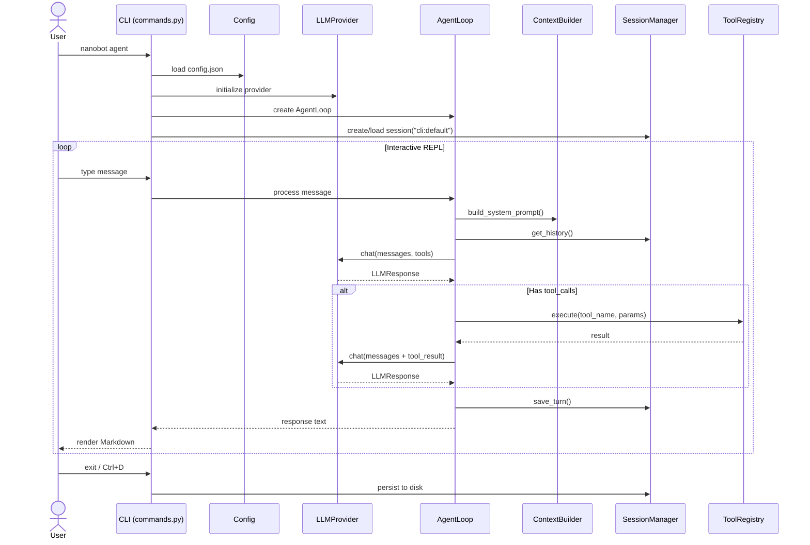
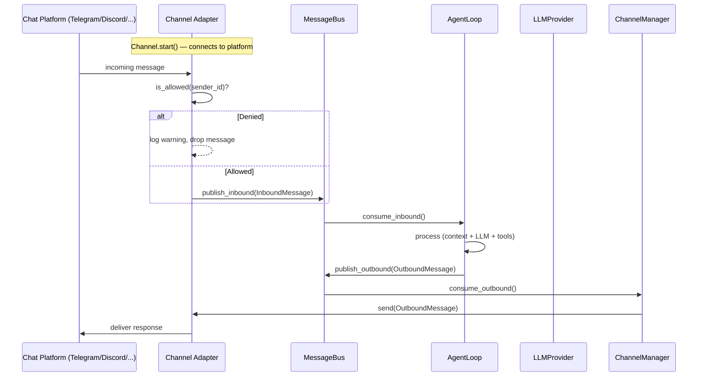
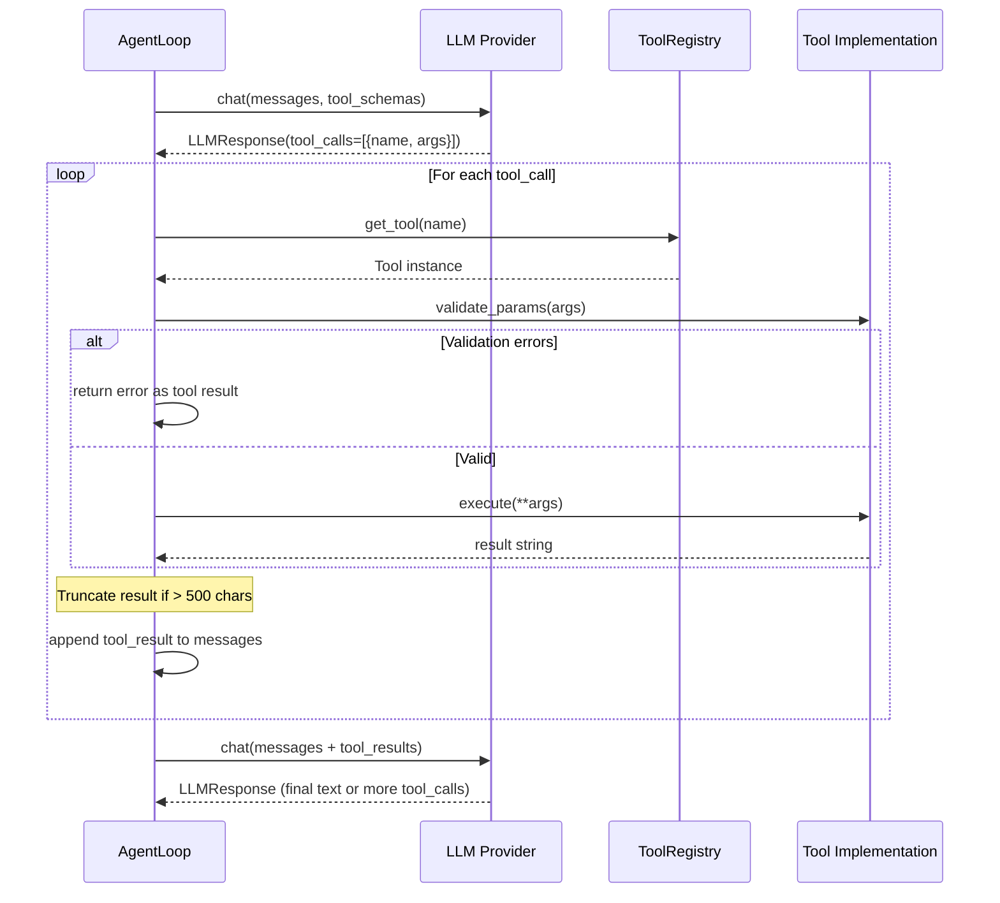
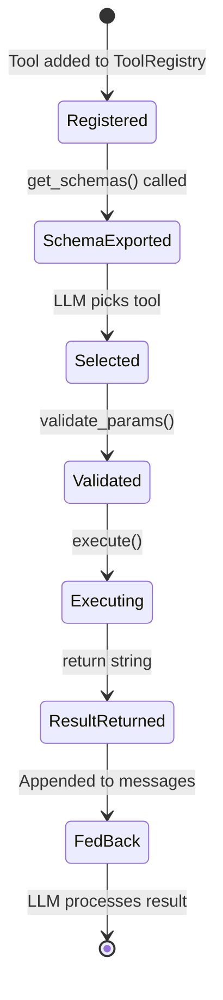
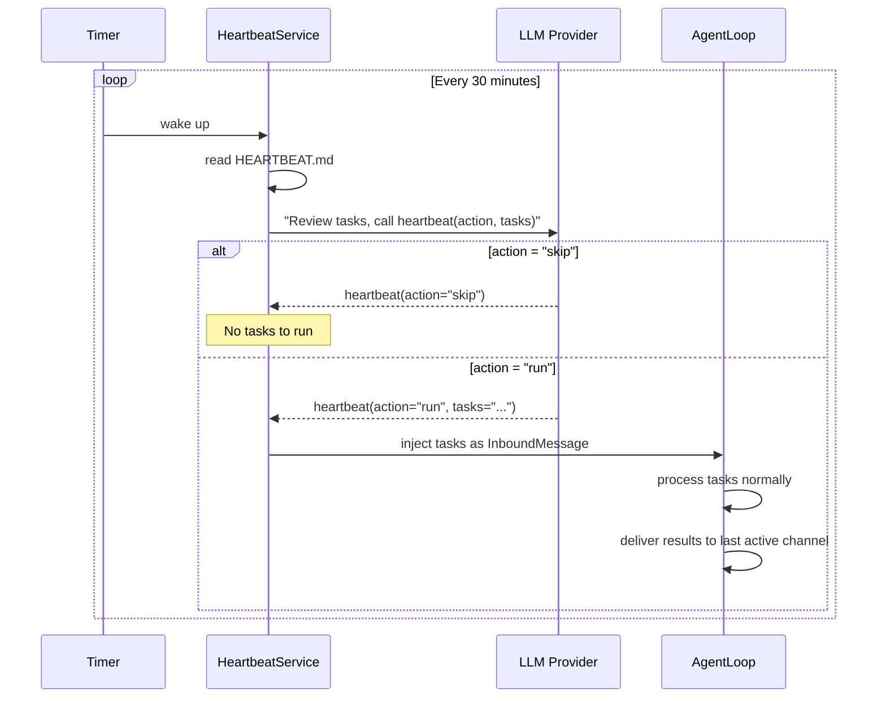
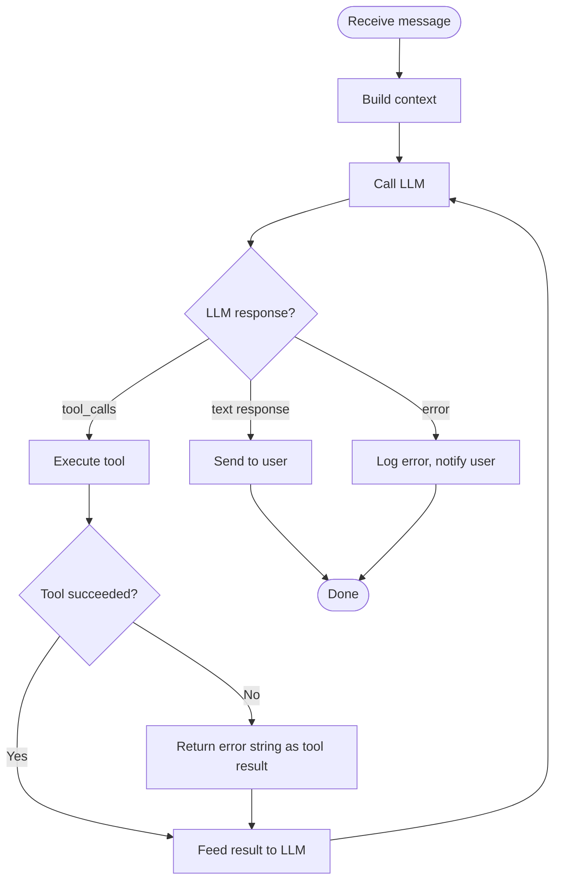

# Business Workflows

## Overview

This document describes the key operational workflows in nanobot. Each workflow includes process steps, sequence diagrams, and code references.

## Workflow Index

1. [Interactive CLI Chat](#workflow-1-interactive-cli-chat)
2. [Gateway Message Processing](#workflow-2-gateway-message-processing)
3. [Tool Execution](#workflow-3-tool-execution)
4. [Heartbeat Periodic Tasks](#workflow-4-heartbeat-periodic-tasks)
5. [Adding a New Provider](#workflow-5-adding-a-new-provider)
6. [Adding a New Channel](#workflow-6-adding-a-new-channel)

---

(workflow-1-interactive-cli-chat)=
## Workflow 1: Interactive CLI Chat

### Overview

The user launches `nanobot agent` and enters a REPL loop for direct conversation with the LLM.

### Sequence Diagram



### Process Steps

1. **Initialization** (`nanobot/cli/commands.py:agent`)
   - Load config from `~/.nanobot/config.json`
   - Initialize the LLM provider based on config
   - Create `AgentLoop` with provider, tools, and session manager
   - Set up `prompt_toolkit` for interactive input with history

2. **Message Input** (`nanobot/cli/commands.py:_init_prompt_session`)
   - Uses `prompt_toolkit.PromptSession` with `FileHistory`
   - Supports multi-line paste, command history, exit commands (`exit`, `quit`, `/exit`, `/quit`, `:q`, Ctrl+D)
   - Optional `-m "message"` flag for single-shot mode (no REPL)

3. **Agent Processing** (`nanobot/agent/loop.py:AgentLoop`)
   - Builds context: identity + bootstrap files + memory + skills
   - Sends to LLM with tool definitions
   - Iterates on tool calls until the LLM produces a final text response

4. **Response Rendering** (`nanobot/cli/commands.py`)
   - Uses `rich.Markdown` for terminal rendering (unless `--no-markdown`)
   - Shows runtime logs if `--logs` flag is set

### Code References

- CLI entry: `nanobot/cli/commands.py:agent` (Typer command)
- Prompt session: `nanobot/cli/commands.py:_init_prompt_session`
- Agent loop: `nanobot/agent/loop.py:AgentLoop`
- Context builder: `nanobot/agent/context.py:ContextBuilder.build_system_prompt`

---

(workflow-2-gateway-message-processing)=
## Workflow 2: Gateway Message Processing

### Overview

The gateway daemon starts all enabled chat channels and processes messages from any platform through a unified pipeline.

### Sequence Diagram



### Process Steps

1. **Gateway Startup** (`nanobot/cli/commands.py:gateway`)
   - Load config
   - Create `MessageBus`
   - Create `ChannelManager` — initializes all enabled channels
   - Create `AgentLoop` — subscribes to inbound queue
   - Start `HeartbeatService` and `CronService`
   - Launch all components as asyncio tasks

2. **Channel Initialization** (`nanobot/channels/manager.py:ChannelManager._init_channels`)
   - For each enabled channel in config, import the channel class and instantiate it
   - Lazy imports prevent loading unused SDKs

3. **Message Flow**
   - Channel receives a platform-specific event (webhook, WebSocket, poll)
   - Channel calls `_handle_message()` → checks `is_allowed()` → creates `InboundMessage` → publishes to bus
   - AgentLoop consumes, processes, and publishes `OutboundMessage`
   - ChannelManager dispatches to the matching channel's `send()` method

4. **Session Routing**
   - Session key: `{channel}:{chat_id}` (e.g., `telegram:12345`)
   - Thread-scoped sessions use `session_key_override` (e.g., Slack threads)

### Code References

- Gateway entry: `nanobot/cli/commands.py:gateway`
- Channel manager: `nanobot/channels/manager.py:ChannelManager`
- Base channel: `nanobot/channels/base.py:BaseChannel`
- Message bus: `nanobot/bus/queue.py:MessageBus`

---

(workflow-3-tool-execution)=
## Workflow 3: Tool Execution

### Overview

When the LLM decides to use a tool, the agent loop executes the tool and feeds the result back into the conversation.

### Sequence Diagram



### Tool Lifecycle



### Built-in Tool Details

| Tool | Parameters | Workspace-Restricted | Side Effects |
|------|-----------|---------------------|-------------|
| `read_file` | path | Yes | None |
| `write_file` | path, content | Yes | Creates/overwrites file |
| `edit_file` | path, old_text, new_text | Yes | Patches file |
| `list_dir` | path | Yes | None |
| `exec` | command | Yes (PATH configurable) | Runs shell command |
| `web_search` | query | No | External HTTP |
| `web_fetch` | url | No | External HTTP |
| `message_user` | content | No | Sends outbound message |
| `spawn` | task | No | Creates subagent |
| `cron` | expression, task | No | Modifies scheduler |

### Code References

- Tool base: `nanobot/agent/tools/base.py:Tool`
- Tool registry: `nanobot/agent/tools/registry.py:ToolRegistry`
- File tools: `nanobot/agent/tools/filesystem.py`
- Shell tool: `nanobot/agent/tools/shell.py:ExecTool`
- Web tools: `nanobot/agent/tools/web.py`
- MCP bridge: `nanobot/agent/tools/mcp.py`

---

(workflow-4-heartbeat-periodic-tasks)=
## Workflow 4: Heartbeat Periodic Tasks

### Overview

The heartbeat service periodically wakes up the agent to check and execute background tasks defined in `HEARTBEAT.md`.

### Sequence Diagram



### Process Steps

1. **Timer fires** every 30 minutes
2. **Read `HEARTBEAT.md`** from `~/.nanobot/workspace/HEARTBEAT.md`
3. **Ask LLM** with a special system prompt and the `heartbeat` tool definition
4. **LLM decides**: `skip` (nothing to do) or `run` (has active tasks)
5. **If `run`**: The task description is injected as an inbound message for the agent loop to process normally
6. **Results delivered** to the most recently active chat channel

### Code References

- Heartbeat service: `nanobot/heartbeat/service.py:HeartbeatService`
- Heartbeat tool schema: `nanobot/heartbeat/service.py:_HEARTBEAT_TOOL`

---

(workflow-5-adding-a-new-provider)=
## Workflow 5: Adding a New Provider

### Overview

Adding a new LLM provider to nanobot requires only 2 steps — no if-elif chains.

### Steps

1. **Add a `ProviderSpec`** to the `PROVIDERS` tuple in `nanobot/providers/registry.py`:

```python
ProviderSpec(
    name="myprovider",
    keywords=("myprovider", "mymodel"),
    env_key="MYPROVIDER_API_KEY",
    display_name="My Provider",
    litellm_prefix="myprovider",
    skip_prefixes=("myprovider/",),
)
```

2. **Add a config field** to `ProvidersConfig` in `nanobot/config/schema.py`:

```python
class ProvidersConfig(Base):
    ...
    myprovider: ProviderConfig = ProviderConfig()
```

The registry-driven design automatically handles:
- Environment variable injection for LiteLLM
- Model name prefixing (`model` → `myprovider/model`)
- Config matching (model keywords → provider detection)
- Status display in `nanobot status`

### Code References

- Provider registry: `nanobot/providers/registry.py`
- Config schema: `nanobot/config/schema.py:ProvidersConfig`
- LiteLLM provider: `nanobot/providers/litellm_provider.py`

---

(workflow-6-adding-a-new-channel)=
## Workflow 6: Adding a New Channel

### Overview

Adding a new chat channel requires implementing the `BaseChannel` interface and registering it in `ChannelManager`.

### Steps

1. **Create the channel file** at `nanobot/channels/myplatform.py`:

```python
class MyPlatformChannel(BaseChannel):
    name = "myplatform"

    async def start(self) -> None:
        # Connect to platform, listen for messages
        # Call self._handle_message() for each incoming message
        pass

    async def stop(self) -> None:
        # Disconnect, clean up
        pass

    async def send(self, msg: OutboundMessage) -> None:
        # Deliver message to the platform
        pass
```

2. **Add config** to `nanobot/config/schema.py`:

```python
class MyPlatformConfig(Base):
    enabled: bool = False
    token: str = ""
    allow_from: list[str] = Field(default_factory=list)

class ChannelsConfig(Base):
    ...
    myplatform: MyPlatformConfig = MyPlatformConfig()
```

3. **Register in ChannelManager** at `nanobot/channels/manager.py:_init_channels`:

```python
if self.config.channels.myplatform.enabled:
    from nanobot.channels.myplatform import MyPlatformChannel
    self.channels["myplatform"] = MyPlatformChannel(
        self.config.channels.myplatform, self.bus
    )
```

### Code References

- Base channel: `nanobot/channels/base.py:BaseChannel`
- Channel manager: `nanobot/channels/manager.py:ChannelManager._init_channels`
- Config schema: `nanobot/config/schema.py:ChannelsConfig`

---

## Error Handling Patterns

### Agent Loop Error Recovery



### Provider Fallback

The registry supports auto-detection of providers based on model name keywords and API key prefixes. If the explicitly configured provider fails, the system logs the error — there is no automatic failover to a different provider (by design, to keep the codebase simple).

## Related Documentation

- [Architecture](02-architecture.md) — Component design
- [Repository Map](01-repo-map.md) — File locations

---

**Last Updated**: 2026-03-15
**Version**: 1.0
