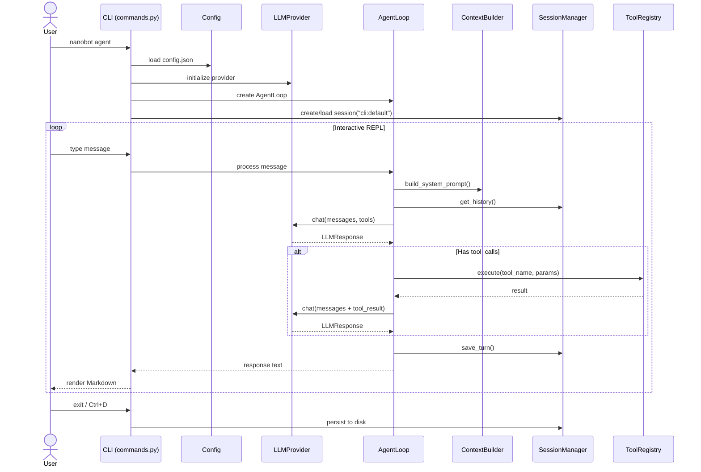
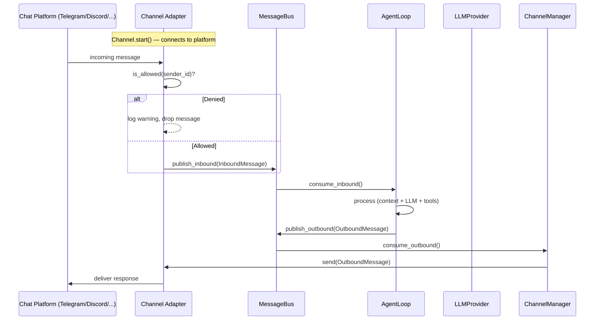
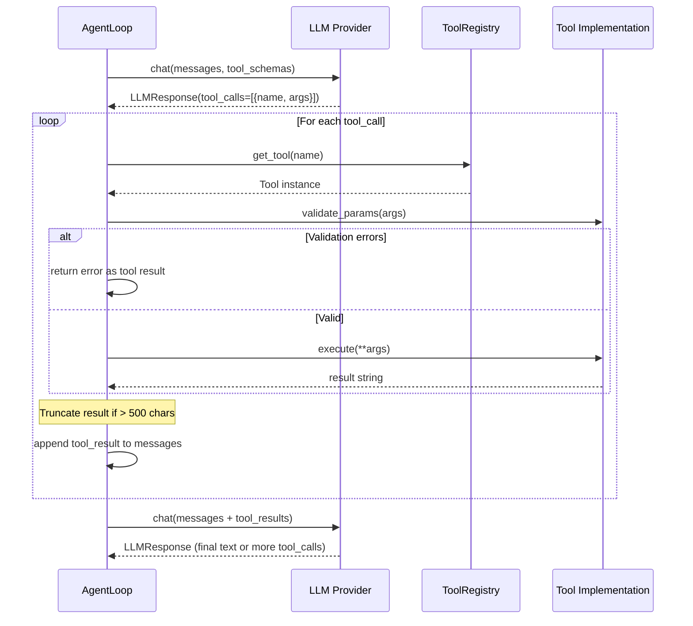
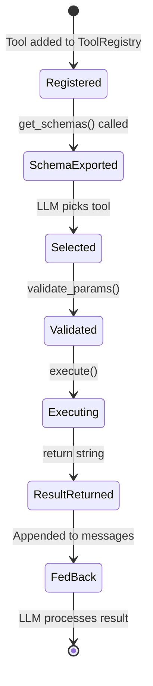
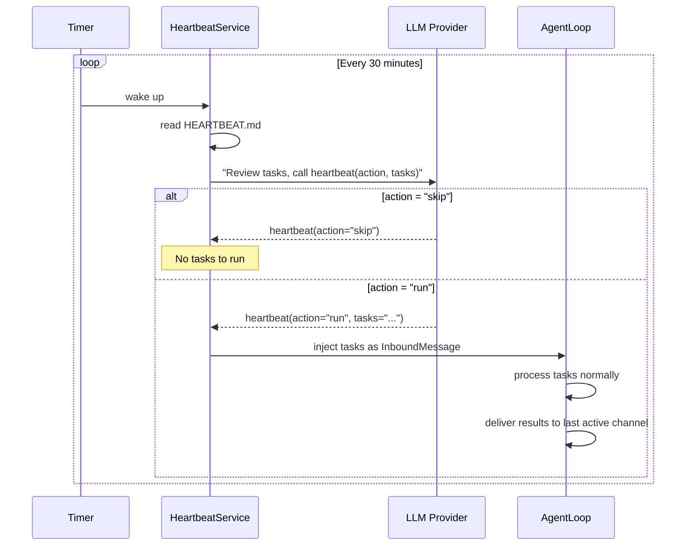
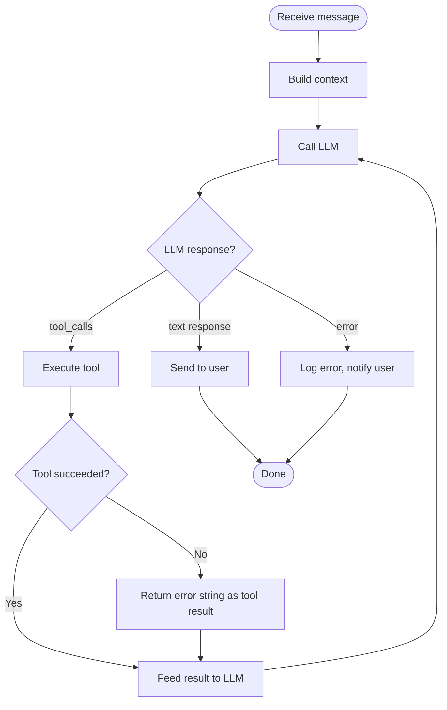

# 业务工作流

## 概述

本文档描述了 nanobot 中的关键业务工作流。每个工作流都包含流程步骤、时序图和代码引用。

## 工作流索引

1. [交互式 CLI 聊天](#zh-workflow-1-interactive-cli-chat)
2. [Gateway 消息处理](#zh-workflow-2-gateway-message-processing)
3. [Tool 执行](#zh-workflow-3-tool-execution)
4. [Heartbeat 定时任务](#zh-workflow-4-heartbeat-periodic-tasks)
5. [添加新的 Provider](#zh-workflow-5-adding-a-new-provider)
6. [添加新的 Channel](#zh-workflow-6-adding-a-new-channel)

---

(zh-workflow-1-interactive-cli-chat)=
## Workflow 1: 交互式 CLI 聊天

### 概述

用户启动 `nanobot agent`，进入一个 REPL 循环，直接与 LLM 对话。

### 时序图



### 流程步骤

1. **初始化** (`nanobot/cli/commands.py:agent`)
   - 从 `~/.nanobot/config.json` 加载配置
   - 根据配置初始化 LLM provider
   - 创建 `AgentLoop`，传入 provider、tools 和 session manager
   - 设置 `prompt_toolkit`，支持交互式输入和历史记录

2. **消息输入** (`nanobot/cli/commands.py:_init_prompt_session`)
   - 使用 `prompt_toolkit.PromptSession` 配合 `FileHistory`
   - 支持多行粘贴、命令历史、退出命令（`exit`、`quit`、`/exit`、`/quit`、`:q`、Ctrl+D）
   - 可选 `-m "message"` 参数实现单次模式（不进入 REPL）

3. **Agent 处理** (`nanobot/agent/loop.py:AgentLoop`)
   - 构建上下文：identity + bootstrap 文件 + memory + skills
   - 携带 tool 定义发送给 LLM
   - 循环处理 tool 调用，直到 LLM 产出最终的文本回复

4. **响应渲染** (`nanobot/cli/commands.py`)
   - 使用 `rich.Markdown` 在终端渲染（除非指定了 `--no-markdown`）
   - 设置 `--logs` 参数时显示运行日志

### 代码引用

- CLI 入口：`nanobot/cli/commands.py:agent`（Typer 命令）
- Prompt 会话：`nanobot/cli/commands.py:_init_prompt_session`
- Agent 循环：`nanobot/agent/loop.py:AgentLoop`
- 上下文构建：`nanobot/agent/context.py:ContextBuilder.build_system_prompt`

---

(zh-workflow-2-gateway-message-processing)=
## Workflow 2: Gateway 消息处理

### 概述

Gateway 守护进程启动所有已启用的聊天 channel，通过统一的管道处理来自各平台的消息。

### 时序图



### 流程步骤

1. **Gateway 启动** (`nanobot/cli/commands.py:gateway`)
   - 加载配置
   - 创建 `MessageBus`
   - 创建 `ChannelManager` — 初始化所有已启用的 channel
   - 创建 `AgentLoop` — 订阅入站队列
   - 启动 `HeartbeatService` 和 `CronService`
   - 以 asyncio 任务的形式启动所有组件

2. **Channel 初始化** (`nanobot/channels/manager.py:ChannelManager._init_channels`)
   - 遍历配置中每个已启用的 channel，导入对应的 channel 类并实例化
   - 延迟导入，避免加载未使用的 SDK

3. **消息流转**
   - Channel 接收平台特定的事件（webhook、WebSocket、轮询）
   - Channel 调用 `_handle_message()` → 检查 `is_allowed()` → 创建 `InboundMessage` → 发布到 bus
   - AgentLoop 消费消息、处理后发布 `OutboundMessage`
   - ChannelManager 将消息分发到对应 channel 的 `send()` 方法

4. **Session 路由**
   - Session key 格式：`{channel}:{chat_id}`（例如 `telegram:12345`）
   - 线程级 session 使用 `session_key_override`（例如 Slack 线程）

### 代码引用

- Gateway 入口：`nanobot/cli/commands.py:gateway`
- Channel 管理器：`nanobot/channels/manager.py:ChannelManager`
- 基础 channel：`nanobot/channels/base.py:BaseChannel`
- 消息总线：`nanobot/bus/queue.py:MessageBus`

---

(zh-workflow-3-tool-execution)=
## Workflow 3: Tool 执行

### 概述

当 LLM 决定使用某个 tool 时，agent loop 会执行该 tool 并将结果反馈到对话中。

### 时序图



### Tool 生命周期



### 内置 Tool 详情

| Tool | 参数 | 受 Workspace 限制 | 副作用 |
|------|------|-------------------|--------|
| `read_file` | path | 是 | 无 |
| `write_file` | path, content | 是 | 创建/覆盖文件 |
| `edit_file` | path, old_text, new_text | 是 | 修改文件 |
| `list_dir` | path | 是 | 无 |
| `exec` | command | 是（PATH 可配置） | 执行 shell 命令 |
| `web_search` | query | 否 | 外部 HTTP 请求 |
| `web_fetch` | url | 否 | 外部 HTTP 请求 |
| `message_user` | content | 否 | 发送出站消息 |
| `spawn` | task | 否 | 创建子 agent |
| `cron` | expression, task | 否 | 修改调度器 |

### 代码引用

- Tool 基类：`nanobot/agent/tools/base.py:Tool`
- Tool 注册表：`nanobot/agent/tools/registry.py:ToolRegistry`
- 文件类 tool：`nanobot/agent/tools/filesystem.py`
- Shell tool：`nanobot/agent/tools/shell.py:ExecTool`
- Web tool：`nanobot/agent/tools/web.py`
- MCP 桥接：`nanobot/agent/tools/mcp.py`

---

(zh-workflow-4-heartbeat-periodic-tasks)=
## Workflow 4: Heartbeat 定时任务

### 概述

Heartbeat 服务定期唤醒 agent，检查并执行 `HEARTBEAT.md` 中定义的后台任务。

### 时序图



### 流程步骤

1. **定时器触发**，每 30 分钟一次
2. **读取 `HEARTBEAT.md`**，路径为 `~/.nanobot/workspace/HEARTBEAT.md`
3. **询问 LLM**，使用专用的 system prompt 和 `heartbeat` tool 定义
4. **LLM 决策**：`skip`（无需执行）或 `run`（有待执行的任务）
5. **如果是 `run`**：任务描述作为入站消息注入 agent loop，按正常流程处理
6. **结果投递**到最近活跃的聊天 channel

### 代码引用

- Heartbeat 服务：`nanobot/heartbeat/service.py:HeartbeatService`
- Heartbeat tool schema：`nanobot/heartbeat/service.py:_HEARTBEAT_TOOL`

---

(zh-workflow-5-adding-a-new-provider)=
## Workflow 5: 添加新的 Provider

### 概述

向 nanobot 添加新的 LLM provider 只需 2 步 — 无需修改 if-elif 链。

### 步骤

1. **在 `nanobot/providers/registry.py` 的 `PROVIDERS` 元组中添加一个 `ProviderSpec`**：

```python
ProviderSpec(
    name="myprovider",
    keywords=("myprovider", "mymodel"),
    env_key="MYPROVIDER_API_KEY",
    display_name="My Provider",
    litellm_prefix="myprovider",
    skip_prefixes=("myprovider/",),
)
```

2. **在 `nanobot/config/schema.py` 的 `ProvidersConfig` 中添加配置字段**：

```python
class ProvidersConfig(Base):
    ...
    myprovider: ProviderConfig = ProviderConfig()
```

基于注册表驱动的设计会自动处理以下事项：
- 为 LiteLLM 注入环境变量
- 模型名称前缀处理（`model` → `myprovider/model`）
- 配置匹配（通过模型关键词 → 自动检测 provider）
- 在 `nanobot status` 中显示状态

### 代码引用

- Provider 注册表：`nanobot/providers/registry.py`
- 配置 schema：`nanobot/config/schema.py:ProvidersConfig`
- LiteLLM provider：`nanobot/providers/litellm_provider.py`

---

(zh-workflow-6-adding-a-new-channel)=
## Workflow 6: 添加新的 Channel

### 概述

添加新的聊天 channel 需要实现 `BaseChannel` 接口，并在 `ChannelManager` 中注册。

### 步骤

1. **创建 channel 文件**，路径为 `nanobot/channels/myplatform.py`：

```python
class MyPlatformChannel(BaseChannel):
    name = "myplatform"

    async def start(self) -> None:
        # Connect to platform, listen for messages
        # Call self._handle_message() for each incoming message
        pass

    async def stop(self) -> None:
        # Disconnect, clean up
        pass

    async def send(self, msg: OutboundMessage) -> None:
        # Deliver message to the platform
        pass
```

2. **在 `nanobot/config/schema.py` 中添加配置**：

```python
class MyPlatformConfig(Base):
    enabled: bool = False
    token: str = ""
    allow_from: list[str] = Field(default_factory=list)

class ChannelsConfig(Base):
    ...
    myplatform: MyPlatformConfig = MyPlatformConfig()
```

3. **在 `nanobot/channels/manager.py:_init_channels` 中注册到 ChannelManager**：

```python
if self.config.channels.myplatform.enabled:
    from nanobot.channels.myplatform import MyPlatformChannel
    self.channels["myplatform"] = MyPlatformChannel(
        self.config.channels.myplatform, self.bus
    )
```

### 代码引用

- 基础 channel：`nanobot/channels/base.py:BaseChannel`
- Channel 管理器：`nanobot/channels/manager.py:ChannelManager._init_channels`
- 配置 schema：`nanobot/config/schema.py:ChannelsConfig`

---

## 错误处理模式

### Agent Loop 错误恢复



### Provider 回退机制

注册表支持根据模型名称关键词和 API key 前缀自动检测 provider。如果显式配置的 provider 调用失败，系统会记录错误日志 — 但不会自动切换到其他 provider（这是有意为之，目的是保持代码简洁）。

## 相关文档

- [架构设计](02-architecture.md) — 组件设计
- [仓库地图](01-repo-map.md) — 文件位置

---

**最后更新**：2026-03-15
**版本**：1.0
