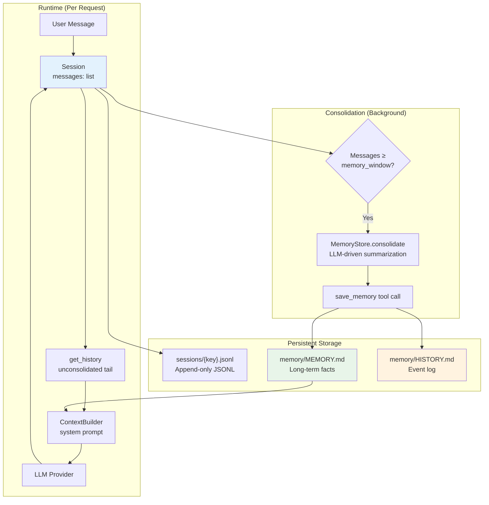
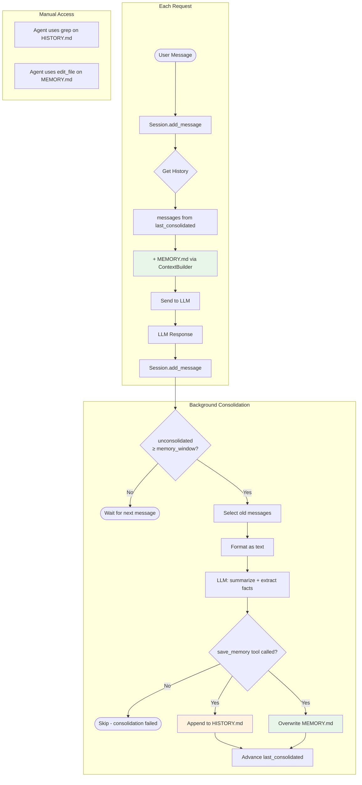

# Memory Mechanism Analysis

## Overview

nanobot implements a **two-layer memory system** that gives the AI agent persistent recall across conversations. The design balances three competing concerns:

1. **LLM context window limits** — conversations grow unbounded, but LLMs have finite context
2. **LLM prompt cache efficiency** — modifying earlier messages invalidates the cache prefix
3. **Long-term knowledge retention** — the agent should remember facts and events across sessions

The solution: an **append-only session** with a sliding **consolidation pointer**, backed by two persistent Markdown files — one for facts (loaded into every prompt) and one for events (searchable via grep).

## Architecture



## The Two Memory Layers

### Layer 1: `MEMORY.md` — Long-term Facts

- **Location**: `~/.nanobot/workspace/memory/MEMORY.md`
- **Content**: Structured Markdown with enduring facts — user preferences, project context, relationships, configuration details
- **Update pattern**: **Full overwrite** — the consolidation LLM rewrites the entire file, merging existing facts with new ones
- **Loaded into**: Every system prompt via `ContextBuilder.build_system_prompt()` → `MemoryStore.get_memory_context()`
- **Size**: Grows slowly (facts are deduplicated and merged by the LLM)

Example content:

```markdown
# User Preferences
- Prefers dark mode
- Timezone: UTC+8

# Project Context
- Working on nanobot, an AI assistant framework
- Uses Python 3.11+, pytest for testing
- API key stored in ~/.nanobot/config.json
```

### Layer 2: `HISTORY.md` — Event Log

- **Location**: `~/.nanobot/workspace/memory/HISTORY.md`
- **Content**: Timestamped paragraph summaries of past conversations
- **Update pattern**: **Append-only** — new entries are appended at the end
- **Loaded into**: **NOT loaded into context** — too large; the agent searches it with `grep` via the `exec` tool
- **Size**: Grows continuously (one entry per consolidation cycle)

Example content:

```markdown
[2026-03-10 14:30] User asked about configuring Telegram bot. Discussed
bot token setup, allowFrom whitelist, and proxy configuration. User chose
to use SOCKS5 proxy at 127.0.0.1:1080.

[2026-03-12 09:15] Debugged a session corruption issue. The problem was
orphaned tool_call_id references after a partial consolidation. Fixed by
deleting the session file and restarting.
```

### How They Work Together

| Aspect | MEMORY.md | HISTORY.md |
|--------|-----------|------------|
| Purpose | "What I know" | "What happened" |
| Analogy | A person's knowledge/beliefs | A person's diary |
| In prompt? | Yes (always) | No (too large) |
| Searchable? | Via context (LLM sees it) | Via `grep -i "keyword" memory/HISTORY.md` |
| Update | Overwrite (merge new + old) | Append (new entries at end) |
| Growth | Slow (deduplicated) | Linear (one entry per consolidation) |

## Session Model

### Append-Only Messages

The `Session` dataclass (`nanobot/session/manager.py`) stores all messages in a `list[dict]`:

```python
@dataclass
class Session:
    key: str                           # "channel:chat_id"
    messages: list[dict[str, Any]]     # Append-only
    last_consolidated: int = 0         # Consolidation pointer
```

**Critical design rule**: Messages are **never modified or deleted**. This preserves LLM prompt cache prefixes — if earlier messages change, the entire cache is invalidated.

### The `last_consolidated` Pointer

The `last_consolidated` field is an integer index that tracks how far consolidation has progressed:

```
messages:       [m0, m1, m2, ..., m14, m15, ..., m24, m25, ..., m59]
                 ↑                       ↑                        ↑
                 0                       15                       59
                 │                       │
                 └─ already consolidated ┘ ← last_consolidated = 15
                                         │                        │
                                         └── unconsolidated ──────┘
```

- `messages[0:last_consolidated]` — already processed by consolidation (summaries in MEMORY.md/HISTORY.md)
- `messages[last_consolidated:]` — not yet consolidated (sent to LLM via `get_history()`)

### History Retrieval

`Session.get_history()` returns only **unconsolidated** messages, with safety checks:

1. Slice from `last_consolidated` to end
2. Trim to `max_messages` (default: 500) from the tail
3. Align to a user turn (drop leading non-user messages)
4. Remove orphaned tool results (tool_call_id without matching assistant tool_calls)
5. Iteratively remove incomplete tool_call groups (assistant with tool_calls but missing results)

This cleanup is essential because consolidation can advance `last_consolidated` to a point that splits a tool_call/tool_result pair across the boundary.

## Consolidation Process

### Trigger

Consolidation is triggered in `AgentLoop._process_message()` when:

```python
unconsolidated = len(session.messages) - session.last_consolidated
if unconsolidated >= self.memory_window and session.key not in self._consolidating:
    # Launch background consolidation task
```

The `memory_window` defaults to **100 messages** (configurable via `agents.defaults.memoryWindow`).

### Execution Flow

```mermaid
sequenceDiagram
    participant Loop as AgentLoop
    participant Store as MemoryStore
    participant LLM as LLM Provider
    participant FS as File System

    Loop->>Loop: unconsolidated >= memory_window?
    Loop->>Loop: asyncio.create_task()

    Note over Loop: Background task starts

    Loop->>Store: consolidate(session, provider, model)

    Store->>Store: keep_count = memory_window // 2
    Store->>Store: old = messages[last_consolidated:-keep_count]
    Store->>Store: Format old messages as text

    Store->>FS: Read MEMORY.md (current facts)

    Store->>LLM: chat(system="consolidation agent",<br/>user="current memory + conversation",<br/>tools=[save_memory])

    LLM-->>Store: tool_call: save_memory(<br/>  history_entry="[2026-03-15] ...",<br/>  memory_update="# Updated facts...")

    Store->>FS: Append history_entry to HISTORY.md
    Store->>FS: Overwrite MEMORY.md with memory_update

    Store->>Store: session.last_consolidated = len(messages) - keep_count

    Note over Loop: Background task completes
```

### Key Details

1. **`keep_count = memory_window // 2`** — With default `memory_window=100`, consolidation keeps the 50 most recent messages unconsolidated. The range `messages[last_consolidated:-50]` is sent to the consolidation LLM.

2. **LLM-driven consolidation** — A separate LLM call (using the same provider and model) acts as a "consolidation agent". It receives:
   - The current `MEMORY.md` content
   - The old messages formatted as `[timestamp] ROLE: content`
   - A `save_memory` tool with two required parameters

3. **The `save_memory` tool** returns:
   - `history_entry`: A 2-5 sentence timestamped paragraph (appended to HISTORY.md)
   - `memory_update`: The full updated MEMORY.md content (existing facts + new facts)

4. **Pointer advance**: After successful consolidation, `last_consolidated` advances to `len(messages) - keep_count`, marking the consolidated range as processed.

### Concurrency Guards

The agent loop includes multiple protections against concurrent consolidation:

| Guard | Purpose | Implementation |
|-------|---------|---------------|
| `_consolidating: set[str]` | Prevents duplicate consolidation tasks for the same session | Checked before creating task; set/cleared around execution |
| `_consolidation_locks: WeakValueDictionary[str, Lock]` | Serializes consolidation for a session (normal + `/new` don't overlap) | `asyncio.Lock` per session key |
| `_consolidation_tasks: set[Task]` | Strong references prevent GC of in-flight tasks | Tasks added on create, removed on completion |

### The `/new` Command

The `/new` slash command starts a fresh session:

1. **Wait** for any in-flight consolidation to finish (acquires the consolidation lock)
2. **Archive** remaining unconsolidated messages with `archive_all=True`
3. **Clear** session messages and reset `last_consolidated` to 0
4. **Save** the empty session to disk

If archival fails, the session is **not cleared** — no data loss.

## Memory Skill (Always Active)

The `memory` skill (`nanobot/skills/memory/SKILL.md`) is marked `always: true`, meaning its content is loaded into every system prompt. It instructs the agent:

- **MEMORY.md** is loaded into context — write important facts there immediately
- **HISTORY.md** is NOT in context — search it with `grep -i "keyword" memory/HISTORY.md`
- Auto-consolidation handles old conversations automatically
- The agent can also manually update MEMORY.md via `edit_file` or `write_file`

## Data Flow Diagram



## Edge Cases and Robustness

### Provider Returns Non-String Arguments

Some LLM providers return `save_memory` arguments as dicts or JSON strings instead of plain strings. The consolidation code handles both:

```python
args = response.tool_calls[0].arguments
if isinstance(args, str):
    args = json.loads(args)          # JSON string → dict
if entry := args.get("history_entry"):
    if not isinstance(entry, str):
        entry = json.dumps(entry)    # dict → JSON string
```

This was a fix for [issue #1042](https://github.com/HKUDS/nanobot/issues/1042).

### LLM Fails to Call save_memory

If the consolidation LLM returns text instead of a tool call, `consolidate()` returns `False` and the pointer is not advanced. No data is lost — consolidation will retry on the next trigger.

### Consolidation Failure

All exceptions in `consolidate()` are caught and logged. The session pointer is not advanced, so the same messages will be re-processed on the next successful consolidation.

### Orphaned Tool Results After Consolidation

When `last_consolidated` advances mid-tool-call sequence, `get_history()` may encounter tool results without their corresponding assistant messages. The iterative cleanup algorithm in `get_history()` handles this by:

1. Tracking all `tool_call_id`s from assistant messages in the current window
2. Dropping tool results whose `tool_call_id` is not in the tracked set
3. Dropping assistant messages whose tool_calls don't all have results
4. Repeating until stable (cascading cleanup)

### Very Large Sessions

For sessions with 1000+ messages, consolidation processes `messages[last_consolidated:-keep_count]`, which could be hundreds of messages formatted as text. This is sent as a single LLM prompt. The LLM's context window is the practical limit.

## Configuration

| Setting | Path | Default | Effect |
|---------|------|---------|--------|
| Memory window | `agents.defaults.memoryWindow` | 100 | Consolidation triggers when unconsolidated messages reach this count |
| Keep count | (derived) | `memory_window // 2` | Number of recent messages kept unconsolidated after consolidation |

Lower `memory_window` values cause more frequent consolidation (smaller batches, more LLM calls). Higher values delay consolidation but send larger batches.

## File References

| Component | File | Key Functions |
|-----------|------|--------------|
| MemoryStore | `nanobot/agent/memory.py` | `consolidate()`, `get_memory_context()`, `read_long_term()`, `write_long_term()`, `append_history()` |
| Session | `nanobot/session/manager.py` | `add_message()`, `get_history()`, `clear()` |
| SessionManager | `nanobot/session/manager.py` | `get_or_create()`, `save()`, `_load()` |
| ContextBuilder | `nanobot/agent/context.py` | `build_system_prompt()` (injects MEMORY.md) |
| AgentLoop | `nanobot/agent/loop.py` | `_process_message()` (triggers consolidation), `_consolidate_memory()` |
| Memory skill | `nanobot/skills/memory/SKILL.md` | Agent instructions (always loaded) |
| save_memory tool | `nanobot/agent/memory.py:_SAVE_MEMORY_TOOL` | LLM tool schema for consolidation |

## Test Coverage

| Test File | What It Tests |
|-----------|--------------|
| `tests/test_consolidate_offset.py` | `last_consolidated` tracking, persistence, slice logic, boundary conditions, archive_all mode, cache immutability, concurrency guards, `/new` command behavior |
| `tests/test_memory_consolidation_types.py` | String/dict/JSON-string argument handling, no-tool-call fallback, skip-when-few-messages |

## Design Trade-offs

| Decision | Benefit | Cost |
|----------|---------|------|
| Append-only messages | LLM cache efficiency; no data loss | Messages list grows unbounded in memory until session is cleared |
| LLM-driven consolidation | High-quality summaries; fact extraction | Extra LLM API call per consolidation; cost |
| MEMORY.md full overwrite | Deduplication; coherent document | Risk of fact loss if LLM omits existing entries |
| HISTORY.md not in context | Keeps prompt size small | Agent must actively grep; may miss relevant history |
| Background consolidation | Non-blocking; doesn't delay user response | Race conditions require concurrency guards |

## Related Documentation

- [Architecture](02-architecture.md) — System design
- [Data Model](04-data-and-api.md) — Storage formats
- [Workflows](03-workflows.md) — Agent loop and tool execution

---

**Last Updated**: 2026-03-15
**Version**: 1.0
