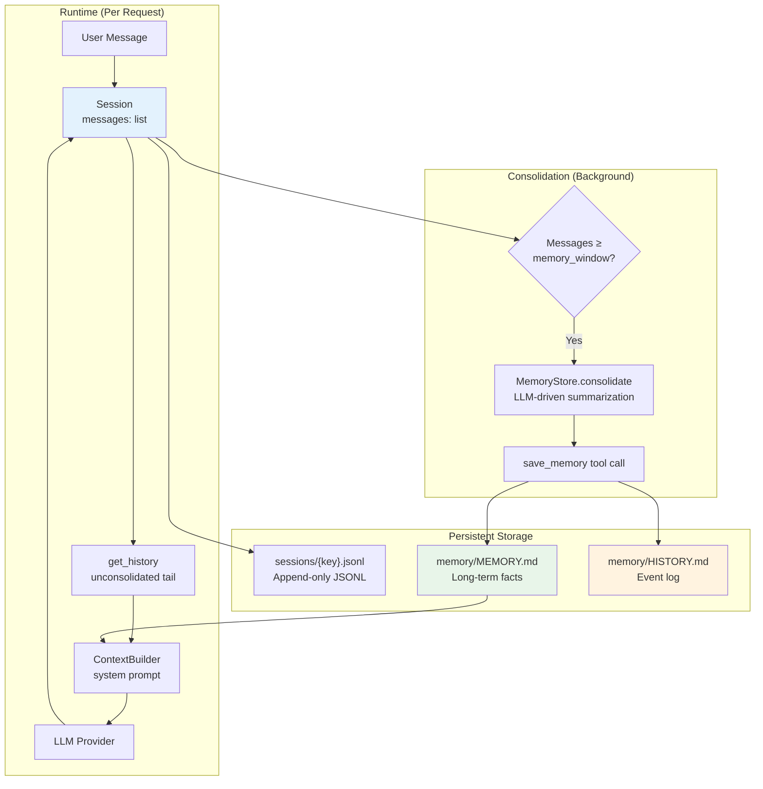
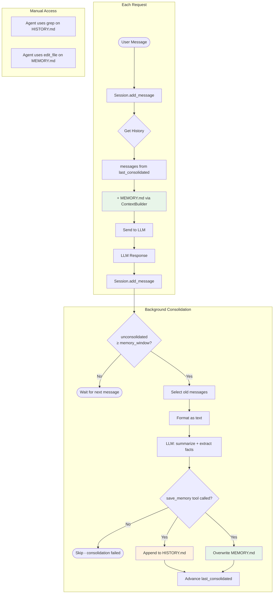

# 记忆机制分析

## 概述

nanobot 实现了一套**双层记忆系统**，赋予 AI agent 跨对话的持久记忆能力。该设计在三个相互制约的需求之间取得平衡：

1. **LLM 上下文窗口限制** — 对话会无限增长，但 LLM 的上下文窗口是有限的
2. **LLM prompt cache 效率** — 修改前面的消息会导致缓存前缀失效
3. **长期知识留存** — agent 需要跨会话记住事实和事件

解决方案：采用**只追加（append-only）的会话**配合滑动的**整合指针（consolidation pointer）**，底层由两个持久化的 Markdown 文件支撑 — 一个存储事实（每次 prompt 都会加载），另一个存储事件（通过 grep 搜索）。

## 架构



## 双层记忆

### 第一层：`MEMORY.md` — 长期事实

- **位置**：`~/.nanobot/workspace/memory/MEMORY.md`
- **内容**：结构化的 Markdown，存储持久性事实 — 用户偏好、项目上下文、关系、配置细节
- **更新方式**：**全量覆写** — 整合 LLM 会重写整个文件，将已有事实与新事实合并
- **加载方式**：通过 `ContextBuilder.build_system_prompt()` → `MemoryStore.get_memory_context()` 注入每次的 system prompt
- **大小**：增长缓慢（LLM 会对事实进行去重和合并）

内容示例：

```markdown
# User Preferences
- Prefers dark mode
- Timezone: UTC+8

# Project Context
- Working on nanobot, an AI assistant framework
- Uses Python 3.11+, pytest for testing
- API key stored in ~/.nanobot/config.json
```

### 第二层：`HISTORY.md` — 事件日志

- **位置**：`~/.nanobot/workspace/memory/HISTORY.md`
- **内容**：带时间戳的段落摘要，记录过去的对话
- **更新方式**：**只追加** — 新条目追加到文件末尾
- **加载方式**：**不加载到上下文中** — 文件太大；agent 通过 `exec` 工具使用 `grep` 搜索
- **大小**：持续增长（每次整合周期产生一条记录）

内容示例：

```markdown
[2026-03-10 14:30] User asked about configuring Telegram bot. Discussed
bot token setup, allowFrom whitelist, and proxy configuration. User chose
to use SOCKS5 proxy at 127.0.0.1:1080.

[2026-03-12 09:15] Debugged a session corruption issue. The problem was
orphaned tool_call_id references after a partial consolidation. Fixed by
deleting the session file and restarting.
```

### 两者如何协同工作

| 维度 | MEMORY.md | HISTORY.md |
|--------|-----------|------------|
| 用途 | "我知道什么" | "发生了什么" |
| 类比 | 一个人的知识/认知 | 一个人的日记 |
| 在 prompt 中？ | 是（始终加载） | 否（太大） |
| 可搜索？ | 通过上下文（LLM 直接可见） | 通过 `grep -i "keyword" memory/HISTORY.md` |
| 更新方式 | 覆写（合并新旧内容） | 追加（新条目在末尾） |
| 增长速度 | 慢（去重合并） | 线性（每次整合一条记录） |

## 会话模型

### 只追加的消息列表

`Session` dataclass（`nanobot/session/manager.py`）将所有消息存储在 `list[dict]` 中：

```python
@dataclass
class Session:
    key: str                           # "channel:chat_id"
    messages: list[dict[str, Any]]     # Append-only
    last_consolidated: int = 0         # Consolidation pointer
```

**关键设计原则**：消息**永远不会被修改或删除**。这保证了 LLM prompt cache 前缀的有效性 — 如果前面的消息发生变化，整个缓存都会失效。

### `last_consolidated` 指针

`last_consolidated` 字段是一个整数索引，用于追踪整合进度：

```
messages:       [m0, m1, m2, ..., m14, m15, ..., m24, m25, ..., m59]
                 ↑                       ↑                        ↑
                 0                       15                       59
                 │                       │
                 └─ already consolidated ┘ ← last_consolidated = 15
                                         │                        │
                                         └── unconsolidated ──────┘
```

- `messages[0:last_consolidated]` — 已被整合处理（摘要已写入 MEMORY.md/HISTORY.md）
- `messages[last_consolidated:]` — 尚未整合（通过 `get_history()` 发送给 LLM）

### 历史消息检索

`Session.get_history()` 只返回**未整合**的消息，并附带安全检查：

1. 从 `last_consolidated` 切片到末尾
2. 从尾部截取 `max_messages`（默认：500）条消息
3. 对齐到 user 轮次（丢弃开头的非 user 消息）
4. 移除孤立的 tool result（`tool_call_id` 找不到对应的 assistant tool_calls）
5. 迭代移除不完整的 tool_call 组（assistant 有 tool_calls 但缺少对应的 result）

这些清理操作至关重要，因为整合可能将 `last_consolidated` 推进到 tool_call/tool_result 对的中间位置，导致它们被分割到边界两侧。

## 整合流程

### 触发条件

整合在 `AgentLoop._process_message()` 中触发，条件如下：

```python
unconsolidated = len(session.messages) - session.last_consolidated
if unconsolidated >= self.memory_window and session.key not in self._consolidating:
    # Launch background consolidation task
```

`memory_window` 默认为 **100 条消息**（可通过 `agents.defaults.memoryWindow` 配置）。

### 执行流程

```mermaid
sequenceDiagram
    participant Loop as AgentLoop
    participant Store as MemoryStore
    participant LLM as LLM Provider
    participant FS as File System

    Loop->>Loop: unconsolidated >= memory_window?
    Loop->>Loop: asyncio.create_task()

    Note over Loop: Background task starts

    Loop->>Store: consolidate(session, provider, model)

    Store->>Store: keep_count = memory_window // 2
    Store->>Store: old = messages[last_consolidated:-keep_count]
    Store->>Store: Format old messages as text

    Store->>FS: Read MEMORY.md (current facts)

    Store->>LLM: chat(system="consolidation agent",<br/>user="current memory + conversation",<br/>tools=[save_memory])

    LLM-->>Store: tool_call: save_memory(<br/>  history_entry="[2026-03-15] ...",<br/>  memory_update="# Updated facts...")

    Store->>FS: Append history_entry to HISTORY.md
    Store->>FS: Overwrite MEMORY.md with memory_update

    Store->>Store: session.last_consolidated = len(messages) - keep_count

    Note over Loop: Background task completes
```

### 关键细节

1. **`keep_count = memory_window // 2`** — 在默认 `memory_window=100` 的情况下，整合后会保留最近 50 条消息不被整合。范围 `messages[last_consolidated:-50]` 会被发送给整合 LLM。

2. **LLM 驱动的整合** — 一次独立的 LLM 调用（使用相同的 provider 和 model）充当"整合 agent"。它接收：
   - 当前 `MEMORY.md` 的内容
   - 旧消息，格式化为 `[timestamp] ROLE: content`
   - 一个 `save_memory` tool，包含两个必填参数

3. **`save_memory` tool** 返回：
   - `history_entry`：一段 2-5 句的带时间戳摘要（追加到 HISTORY.md）
   - `memory_update`：完整的更新后 MEMORY.md 内容（已有事实 + 新事实）

4. **指针推进**：整合成功后，`last_consolidated` 推进到 `len(messages) - keep_count`，将已整合的范围标记为已处理。

### 并发保护

agent loop 包含多重保护机制，防止并发整合：

| 保护机制 | 用途 | 实现方式 |
|-------|---------|---------------|
| `_consolidating: set[str]` | 防止同一会话的重复整合任务 | 创建任务前检查；执行前后设置/清除 |
| `_consolidation_locks: WeakValueDictionary[str, Lock]` | 对同一会话的整合进行串行化（普通整合与 `/new` 不会重叠） | 每个 session key 一个 `asyncio.Lock` |
| `_consolidation_tasks: set[Task]` | 强引用防止进行中的任务被 GC 回收 | 创建时加入集合，完成时移除 |

### `/new` 命令

`/new` 斜杠命令用于开启新会话：

1. **等待**进行中的整合完成（获取 consolidation lock）
2. **归档**剩余未整合的消息，设置 `archive_all=True`
3. **清空**会话消息并将 `last_consolidated` 重置为 0
4. **保存**空会话到磁盘

如果归档失败，会话**不会被清空** — 不会丢失数据。

## Memory Skill（始终激活）

`memory` skill（`nanobot/skills/memory/SKILL.md`）标记为 `always: true`，意味着其内容会被加载到每次的 system prompt 中。它指导 agent：

- **MEMORY.md** 已加载到上下文中 — 重要事实应立即写入
- **HISTORY.md** 不在上下文中 — 通过 `grep -i "keyword" memory/HISTORY.md` 搜索
- 自动整合会处理旧对话
- agent 也可以通过 `edit_file` 或 `write_file` 手动更新 MEMORY.md

## 数据流图



## 边界情况与健壮性

### Provider 返回非字符串参数

部分 LLM provider 会将 `save_memory` 的参数以 dict 或 JSON 字符串的形式返回，而非纯字符串。整合代码对两种情况都做了处理：

```python
args = response.tool_calls[0].arguments
if isinstance(args, str):
    args = json.loads(args)          # JSON string → dict
if entry := args.get("history_entry"):
    if not isinstance(entry, str):
        entry = json.dumps(entry)    # dict → JSON string
```

这是针对 [issue #1042](https://github.com/HKUDS/nanobot/issues/1042) 的修复。

### LLM 未调用 save_memory

如果整合 LLM 返回的是文本而非 tool call，`consolidate()` 会返回 `False`，指针不会推进。不会丢失数据 — 下次触发时会重试整合。

### 整合失败

`consolidate()` 中的所有异常都会被捕获并记录日志。会话指针不会推进，因此相同的消息会在下次成功整合时被重新处理。

### 整合后的孤立 Tool Result

当 `last_consolidated` 推进到 tool_call 序列中间时，`get_history()` 可能会遇到没有对应 assistant 消息的 tool result。`get_history()` 中的迭代清理算法通过以下方式处理：

1. 追踪当前窗口内所有 assistant 消息中的 `tool_call_id`
2. 丢弃 `tool_call_id` 不在追踪集合中的 tool result
3. 丢弃 tool_calls 没有全部获得 result 的 assistant 消息
4. 重复直到稳定（级联清理）

### 超大会话

对于 1000+ 条消息的会话，整合处理的范围是 `messages[last_consolidated:-keep_count]`，可能包含数百条格式化为文本的消息。这些内容会作为单次 LLM prompt 发送。LLM 的上下文窗口是实际的限制因素。

## 配置

| 配置项 | 路径 | 默认值 | 效果 |
|---------|------|---------|--------|
| Memory window | `agents.defaults.memoryWindow` | 100 | 未整合消息达到此数量时触发整合 |
| Keep count | （派生值） | `memory_window // 2` | 整合后保留的最近未整合消息数量 |

较低的 `memory_window` 值会导致更频繁的整合（更小的批次，更多的 LLM 调用）。较高的值会延迟整合，但每次处理更大的批次。

## 文件参考

| 组件 | 文件 | 关键函数 |
|-----------|------|--------------|
| MemoryStore | `nanobot/agent/memory.py` | `consolidate()`, `get_memory_context()`, `read_long_term()`, `write_long_term()`, `append_history()` |
| Session | `nanobot/session/manager.py` | `add_message()`, `get_history()`, `clear()` |
| SessionManager | `nanobot/session/manager.py` | `get_or_create()`, `save()`, `_load()` |
| ContextBuilder | `nanobot/agent/context.py` | `build_system_prompt()`（注入 MEMORY.md） |
| AgentLoop | `nanobot/agent/loop.py` | `_process_message()`（触发整合）, `_consolidate_memory()` |
| Memory skill | `nanobot/skills/memory/SKILL.md` | Agent 指令（始终加载） |
| save_memory tool | `nanobot/agent/memory.py:_SAVE_MEMORY_TOOL` | 整合用的 LLM tool schema |

## 测试覆盖

| 测试文件 | 测试内容 |
|-----------|--------------|
| `tests/test_consolidate_offset.py` | `last_consolidated` 追踪、持久化、切片逻辑、边界条件、archive_all 模式、cache 不可变性、并发保护、`/new` 命令行为 |
| `tests/test_memory_consolidation_types.py` | String/dict/JSON-string 参数处理、无 tool call 的回退、消息过少时跳过整合 |

## 设计权衡

| 决策 | 收益 | 代价 |
|----------|---------|------|
| 只追加消息 | LLM cache 效率高；不丢数据 | 消息列表在内存中无限增长，直到会话被清空 |
| LLM 驱动的整合 | 高质量摘要；事实提取 | 每次整合额外消耗一次 LLM API 调用；有成本 |
| MEMORY.md 全量覆写 | 去重；文档保持连贯 | 如果 LLM 遗漏已有条目，存在事实丢失风险 |
| HISTORY.md 不加载到上下文 | 保持 prompt 体积小 | agent 必须主动 grep；可能遗漏相关历史 |
| 后台整合 | 非阻塞；不延迟用户响应 | 竞态条件需要并发保护机制 |

## 相关文档

- [架构](02-architecture.md) — 系统设计
- [数据模型](04-data-and-api.md) — 存储格式
- [工作流](03-workflows.md) — Agent loop 与 tool 执行

---

**最后更新**：2026-03-15
**版本**：1.0
