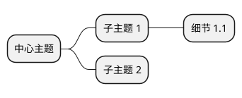

# 功能特性清单

## 核心功能

### 1. 智能网页抓取 🕷️

#### 抓取工具
- **`fetch_static`** - HTTP GET 静态抓取
  - ✅ 适用于服务端渲染的页面
  - ✅ 速度快，资源占用少
  - ✅ 支持博客、文档、静态网站

- **`fetch_dynamic`** - Playwright 浏览器渲染
  - ✅ 适用于 SPA 单页应用
  - ✅ 支持 JavaScript 渲染的内容
  - ✅ 可处理动态加载的页面

#### 智能决策
- ✅ 自动选择最佳抓取策略
- ✅ 失败自动重试备用方法
- ✅ 内容质量检测和警告

---

### 2. ReAct Agent 决策层 🧠

#### LangGraph 状态图
- ✅ 可视化的决策流程
- ✅ 状态管理和循环控制
- ✅ 安全阀防止无限循环（最多 5 次迭代）

#### 工具调用
- ✅ 自动解析 LLM 的工具调用请求
- ✅ 执行工具并返回结果
- ✅ 反馈给 LLM 继续推理

#### 可观测性
- ✅ 实时显示推理过程
- ✅ 工具调用日志
- ✅ 观察结果预览

---

### 3. 翻译与内容处理 📝

#### 智能翻译
- ✅ 英文 → 中文专业翻译
- ✅ 分块处理（每块 3000 字符）
- ✅ 保持段落结构
- ✅ 专业术语保留英文

#### 质量保证
- ✅ 自动质量检查
- ✅ 漏译、误译检测
- ✅ 术语准确性验证
- ✅ 通顺度评估

---

### 4. 内容分析 🔍

#### 要点总结
- ✅ 提取 5-10 个关键要点
- ✅ 编号列表格式
- ✅ 中文输出

#### 难点解释
- ✅ 识别 3-5 个最难理解的概念
- ✅ 用简单语言解释
- ✅ 类比说明

#### 思维导图
- ✅ 自动生成 PlantUML 脚本
- ✅ 分层展示文章结构
- ✅ 在线渲染链接
- ✅ 本地 PNG 图片（可选）

---

### 5. Markdown 报告生成 📄

#### 完整报告内容
- ✅ **中文翻译**（完整，非截断）
- ✅ **要点总结**
- ✅ **难点解释**
- ✅ **PlantUML 思维导图脚本**
- ✅ **在线查看链接**
- ✅ **本地图片引用**
- ✅ **原文**（折叠显示）
- ✅ **元信息**（生成时间、原文链接）

#### 报告特性
- ✅ 标准 Markdown 格式
- ✅ 目录导航
- ✅ 分节清晰
- ✅ 方便分享和存档
- ✅ 支持版本控制

#### 文件输出
```
report.md         ← 完整 Markdown 报告
mindmap.puml      ← PlantUML 源码
mindmap.png       ← 思维导图图片（可选）
```

---

### 6. 本地 LLM 支持 🖥️

#### OpenAI 兼容 API
- ✅ 支持任何 OpenAI 兼容的 API
- ✅ 自定义 `base_url`
- ✅ 自定义模型名称

#### 常见本地部署
- ✅ Ollama
- ✅ vLLM
- ✅ LocalAI
- ✅ LM Studio
- ✅ Text Generation WebUI

#### 自签名证书处理
- ✅ 一行配置禁用 SSL 验证
- ✅ 支持自签名证书
- ✅ 适合内网部署

---

### 7. 开发者友好 👨‍💻

#### 延迟初始化
- ✅ 模块可导入但不立即初始化
- ✅ 测试友好
- ✅ 无需 API key 即可导入

#### 配置灵活
- ✅ 环境变量配置
- ✅ `.env` 文件支持
- ✅ 代码中可覆盖配置

#### 错误处理
- ✅ 友好的错误提示
- ✅ 自动重试机制
- ✅ 降级策略

#### 可扩展性
- ✅ 易于添加新工具
- ✅ 易于添加新节点
- ✅ 易于修改 Prompt

---

## 技术栈

### 核心框架
- **LangGraph** - 状态图和 ReAct 循环
- **LangChain** - LLM 集成和 Prompt 管理
- **OpenAI API** - LLM 调用（兼容本地）

### 网页抓取
- **Requests** - HTTP 请求
- **BeautifulSoup4** - HTML 解析
- **Readability** - 正文提取
- **Playwright** - 浏览器自动化

### 工具
- **python-dotenv** - 环境变量管理
- **httpx** - HTTP 客户端（支持 SSL 配置）

---

## 使用场景

### ✅ 适用
- 📚 阅读英文技术博客
- 📄 理解学术论文
- 🌐 翻译技术文档
- 🧠 快速理解长文章
- 🗺️ 生成文章思维导图
- 📁 归档和分享（Markdown）

### ❌ 不适用
- 🔒 需要登录的页面
- 💰 付费墙内容
- 🚫 严格反爬的网站
- 📹 视频内容
- 🎵 音频内容

---

## 性能特性

### 速度优化
- ✅ 静态抓取优先（速度快）
- ✅ 分块并行翻译
- ✅ 本地 LLM 低延迟

### 成本优化
- ✅ 支持免费的本地 LLM
- ✅ 可选择较小模型
- ✅ 分块处理节省 token

### 质量保证
- ✅ 双重翻译检查
- ✅ 内容长度验证
- ✅ 错误自动重试

---

## 输出格式

### Markdown 报告 (`report.md`)
```markdown
# 文章分析报告

**生成时间**: 2024-02-14 21:30:00
**原文链接**: https://example.com/article

## 目录
- 中文翻译
- 要点总结
- 难点解释
- 思维导图
- 原文

## 中文翻译
[完整翻译内容]

## 要点总结
1. 要点 1
2. 要点 2
...

## 难点解释
### 概念 1
[解释]

## 思维导图
[PlantUML 脚本 + 在线链接 + 本地图片]

## 原文
[折叠显示]
```

### PlantUML 源码 (`mindmap.puml`)


### 思维导图图片 (`mindmap.png`)
- PNG 格式
- 自动渲染
- 可在报告中查看

---

## 扩展性

### 易于扩展的方面

#### 1. 添加新工具
```python
@tool
def fetch_pdf(url: str) -> str:
    """从 PDF 提取文本"""
    pass

ALL_TOOLS = [fetch_static, fetch_dynamic, fetch_pdf]
```

#### 2. 添加新节点
```python
def validate_node(state: AgentState) -> dict:
    """验证内容质量"""
    pass

workflow.add_node("validate", validate_node)
```

#### 3. 自定义 Prompt
- 编辑 `graph.py` 中的 `AGENT_SYSTEM_PROMPT`
- 编辑 `pipeline.py` 中的各个 Prompt 模板

#### 4. 自定义输出
- 修改 `save_markdown_report()` 函数
- 添加新的输出格式（JSON、PDF 等）

---

## 测试

### 安装测试
```bash
poetry run python test_setup.py
```

### Markdown 生成测试
```bash
poetry run python test_markdown.py
```

### 功能测试
```bash
poetry run python -m academic_url_agent.main "https://example.com"
```

---

## 配置选项

### 环境变量

| 变量 | 必需 | 默认值 | 说明 |
|------|------|--------|------|
| `LLM_API_KEY` | ✅ | - | API 密钥 |
| `LLM_BASE_URL` | ❌ | OpenAI | API 基础 URL |
| `LLM_MODEL` | ❌ | gpt-4o-mini | 模型名称 |
| `DISABLE_SSL_VERIFY` | ❌ | false | 禁用 SSL 验证 |

### 代码配置

```python
# pipeline.py 中可配置：
MAX_CHARS = 3000           # 每块最大字符数
PLANTUML_URL = "..."       # PlantUML 渲染服务

# graph.py 中可配置：
MAX_ITERATIONS = 5         # 最大循环次数
AGENT_SYSTEM_PROMPT = ...  # Agent 系统提示
```

---

## 许可证

请参考项目根目录的 LICENSE 文件。

---

**功能持续更新中... 欢迎贡献！** 🎉
