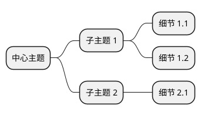
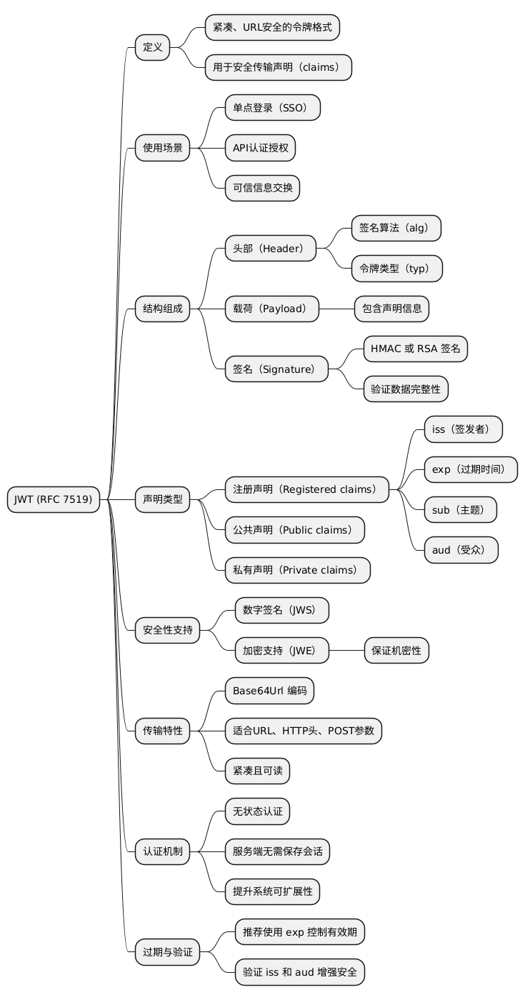

# 文章分析报告示例

这是 `report.md` 的示例格式。

---

## 实际输出示例

当你运行：
```bash
poetry run python -m academic_url_agent.main "https://example.com/article"
```

会生成一个 `report.md` 文件，包含以下结构：

---

# 文章分析报告

**生成时间**: 2024-02-14 21:30:00

**原文链接**: https://example.com/article

---

## 目录

- [中文翻译](#中文翻译)
- [要点总结](#要点总结)
- [难点解释](#难点解释)
- [思维导图](#思维导图)
- [原文](#原文)

---

## 中文翻译

这里会包含完整的中文翻译内容，包括所有段落...

（控制台只显示前 2000 字符，完整内容在这里）

---

## 要点总结

1. 第一个要点...
2. 第二个要点...
3. ...

---

## 难点解释

### 1. 概念 A

解释内容...

### 2. 概念 B

解释内容...

---

## 思维导图

### PlantUML 脚本



### 在线查看

[在线渲染思维导图](https://www.plantuml.com/plantuml/uml/...)

### 本地图片



---

## 原文

<details>
<summary>点击展开原文</summary>

```text
原始英文内容...
```

</details>

---

**报告生成完成** ✅

> 由 [Academic URL Agent](https://github.com/your-repo/academic-url-agent) 自动生成

---

## 文件结构

运行后会在当前目录生成：

```
academic_url_agent/
├── report.md         ← 完整 Markdown 报告（所有内容）
├── mindmap.puml      ← PlantUML 源码
└── mindmap.png       ← 思维导图图片（可选）
```

## 使用建议

1. **阅读完整翻译**: 打开 `report.md`
2. **分享和存档**: Markdown 格式方便版本控制和分享
3. **查看思维导图**:
   - 本地图片: `mindmap.png`
   - 在线查看: 点击报告中的链接
   - 编辑源码: `mindmap.puml`

## 高级功能

### 自定义输出路径

编辑 `main.py`：

```python
result = run_pipeline(content, url=url)
# 修改为：
result = run_pipeline(
    content,
    url=url,
    output_path="my_report.md"  # 自定义文件名
)
```

### 导出为 PDF

使用 Markdown 转 PDF 工具：

```bash
# 使用 pandoc
pandoc report.md -o report.pdf

# 使用 markdown-pdf
markdown-pdf report.md
```

### 集成到工作流

```bash
# 批量处理
for url in $(cat urls.txt); do
  poetry run python -m academic_url_agent.main "$url"
  mv report.md "reports/$(date +%s).md"
done
```
