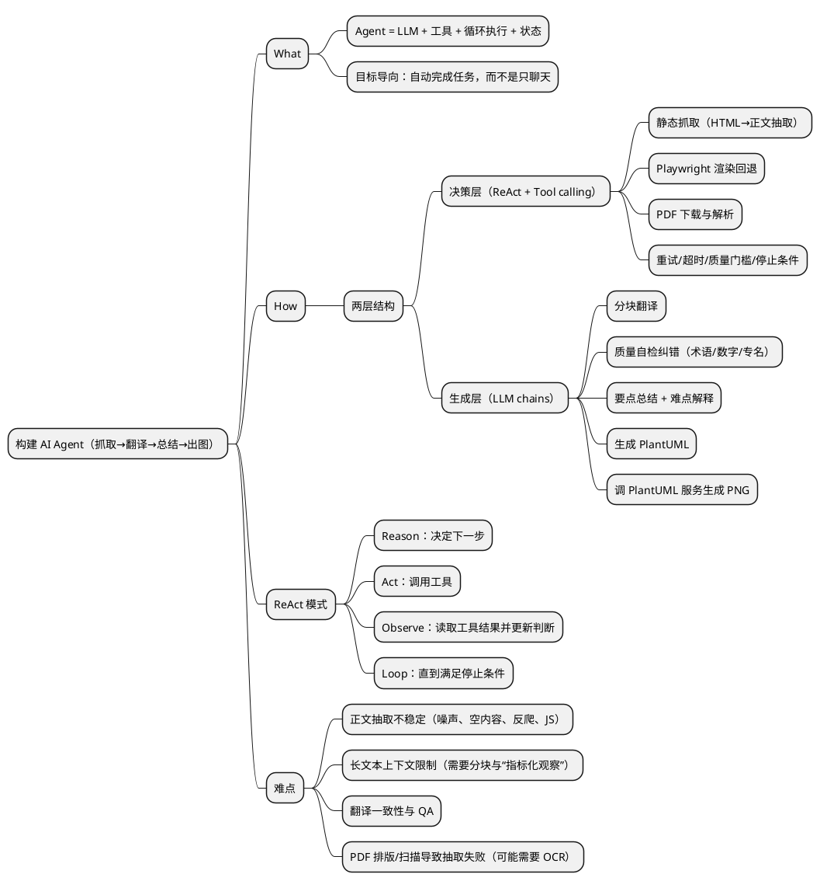

# 用简练易懂的方式：如何构建 AI Agent（并给出可运行的 ReAct 抓取→翻译→总结→出思维导图示例）

这篇文章用一个“**输入 URL → 自动抓取英文正文 → 英译中 → 自检纠错 → 总结难点与要点 → 生成 PlantUML 思维导图并输出 PNG**”的小项目，解释 **AI Agent 的 What & How**、**ReAct 模式**、以及你要求的两层结构（决策层 / 生成层）。

---

## 1) AI Agent 是什么（What）

**AI Agent** 可以理解为：  
> 一个“会自己拆任务、会选择工具、会循环尝试直到得到结果”的 LLM 应用。

与普通 Chat（一次问答）相比，Agent 的关键点在于：

- **它不只生成文本**：它会根据目标去“调用工具”（抓网页、渲染、解析 PDF、重试……）
- **它有流程与状态**：每一步会把“观察到的结果（Observation）”反馈给模型，继续推理与行动
- **它可控**：你可以限制最大步数、设定停止条件、加质量评估与回退方案

---

## 2) 怎么构建（How）：两层结构（你要的架构）

你给的结构非常典型，我用更落地的语言复述一下：

### A. 决策层（Agent + Tool calling）
目标：**怎么拿到高质量英文正文**

它会在工具之间做决策与回退，例如：

- 静态抓取（HTML 直接下载 + 正文抽取）
- Playwright 渲染（应对前端渲染 / 反爬导致的空内容）
- 找 PDF / 下载 PDF / 解析 PDF
- 重试与调参（超时、UA、等待时间、提取器参数）

> 这里最适合用 ReAct：让模型“边想边做”，多轮调用工具，直到正文质量达标。

LangChain 的 `ChatOpenAI.bind_tools` 支持把工具注册给模型，并在返回的 `AIMessage` 里看到 `tool_calls` 字段。 ([docs.langchain.com](https://docs.langchain.com/oss/python/integrations/chat/openai/))

---

### B. 生成层（LLM chains）
目标：**拿到正文后做一系列稳定的文本加工流水线**

推荐拆成固定步骤（chains），例如：

1) 分块翻译（避免超长上下文）
2) 质量自检纠错（术语、数字、专有名词、漏译）
3) 要点总结 + 难点解释
4) 生成 PlantUML 脚本
5) 调 PlantUML 服务生成 PNG（或本地 jar）

PlantUML Server 的 PNG 接口形式是 `/plantuml/png/ENCODED`。 ([plantuml.com](https://plantuml.com/server?utm_source=openai))

---

## 3) ReAct（Reason-Act-Observe）模式解释

**ReAct** 的核心循环是：

1. **Reason**：模型根据“当前目标 + 已知信息”决定下一步
2. **Act**：调用一个工具（抓取 / 渲染 / 解析 PDF …）
3. **Observe**：把工具结果（例如提取到的正文长度、预览、错误信息）喂回给模型
4. 重复以上过程，直到满足停止条件（例如正文长度足够、语言是英文、无报错）

你要的“怎么实现 ReAct”，最直观的方式就是：**自己写一个 while 循环 + 解析 `tool_calls` + 执行工具 + 追加 ToolMessage**。下面的示例就是这么做的（不用黑盒 prebuilt agent）。

（补充：LangGraph 也提供了 prebuilt 的 `create_react_agent`，本质就是把这个循环封装好。 ([langchain-ai.lang.chat](https://langchain-ai.lang.chat/langgraph/reference/agents/?utm_source=openai))）

---

## 4) 实际运行项目：Python + LangChain + Poetry（可跑的最小例子）

### 4.1 项目结构

```
react-url-agent/
  pyproject.toml
  react_url_agent/
    __init__.py
    main.py
```

---

### 4.2 pyproject.toml（Poetry）

> 说明：为了“可运行 + 代码尽量短”，我选了：
> - 抓取正文：trafilatura（静态正文抽取很省事） ([trafilatura.readthedocs.io](https://trafilatura.readthedocs.io/en/stable/quickstart.html?utm_source=openai))  
> - PDF：pypdf ([pypdf.readthedocs.io](https://pypdf.readthedocs.io/en/3.16.3/user/extract-text.html?utm_source=openai))  
> - 渲染：playwright（可选，但建议装上做回退） ([playwright.dev](https://playwright.dev/python/docs/library?utm_source=openai))  
> - 分块：langchain-text-splitters 的 `RecursiveCharacterTextSplitter` ([docs.langchain.com](https://docs.langchain.com/oss/python/integrations/splitters/recursive_text_splitter?utm_source=openai))  
> - 画图：pythonplantuml（直接把 puml 变 png） ([pypi.org](https://pypi.org/project/pythonplantuml/))  

```toml
[tool.poetry]
name = "react-url-agent"
version = "0.1.0"
description = "A runnable ReAct agent: fetch URL -> translate -> QA -> summarize -> PlantUML mindmap -> PNG"
authors = ["you <you@example.com>"]
readme = "README.md"
packages = [{ include = "react_url_agent" }]

[tool.poetry.dependencies]
python = "^3.11"

langchain-openai = "^0.3.0"
langchain-core = "^0.3.0"
langchain-text-splitters = "^0.3.0"

trafilatura = "^2.0.0"
requests = "^2.32.0"
pypdf = "^3.16.0"
playwright = "^1.40.0"

pythonplantuml = "^0.2.1"

[tool.poetry.scripts]
react-url-agent = "react_url_agent.main:main"

[build-system]
requires = ["poetry-core"]
build-backend = "poetry.core.masonry.api"
```

> 版本号你可以放宽；但如果你追求“我电脑上一次就跑通”，**建议固定版本**，避免 LangChain API 变动。

---

### 4.3 核心代码：ReAct 决策层 + 生成层流水线（main.py）

> 重点看：`run_react_extraction()` 里那段循环，就是 ReAct（Reason-Act-Observe）最小实现。

```python
# react_url_agent/main.py
from __future__ import annotations

import json
import os
import re
import uuid
from dataclasses import dataclass
from pathlib import Path
from typing import Any, Dict, Optional, List, Tuple

import requests
from pypdf import PdfReader  # PDF text extraction ([pypdf.readthedocs.io](https://pypdf.readthedocs.io/en/3.16.3/user/extract-text.html?utm_source=openai))
from trafilatura import fetch_url, extract  # main-text extraction ([trafilatura.readthedocs.io](https://trafilatura.readthedocs.io/en/stable/quickstart.html?utm_source=openai))

from playwright.sync_api import sync_playwright  # rendered fallback ([playwright.dev](https://playwright.dev/python/docs/library?utm_source=openai))

from pythonplantuml import generate_uml_png  # PlantUML -> PNG ([pypi.org](https://pypi.org/project/pythonplantuml/))

from langchain_openai import ChatOpenAI
from langchain_core.tools import tool
from langchain_core.messages import SystemMessage, HumanMessage, ToolMessage, AIMessage

from langchain_text_splitters import RecursiveCharacterTextSplitter  # chunking ([docs.langchain.com](https://docs.langchain.com/oss/python/integrations/splitters/recursive_text_splitter?utm_source=openai))


OUT_DIR = Path("out")
OUT_DIR.mkdir(exist_ok=True)


# -------------------------
# Tools (for decision layer)
# -------------------------

def _save_text(text: str, suffix: str = ".txt") -> str:
    OUT_DIR.mkdir(exist_ok=True)
    p = OUT_DIR / f"{uuid.uuid4().hex}{suffix}"
    p.write_text(text, encoding="utf-8")
    return str(p)


def _looks_like_pdf(url: str, content_type: str | None) -> bool:
    if url.lower().endswith(".pdf"):
        return True
    if content_type and "pdf" in content_type.lower():
        return True
    return False


@tool
def fetch_static_main_text(url: str) -> dict:
    """Fetch URL via static HTTP and extract main article text (best for normal HTML pages)."""
    try:
        downloaded = fetch_url(url)
        if not downloaded:
            return {"ok": False, "method": "static", "error": "fetch_url() returned empty", "chars": 0}

        text = extract(downloaded)
        if not text:
            return {"ok": False, "method": "static", "error": "extract() returned empty", "chars": 0}

        path = _save_text(text, ".txt")
        preview = text[:800]
        return {"ok": True, "method": "static", "path": path, "chars": len(text), "preview": preview}
    except Exception as e:
        return {"ok": False, "method": "static", "error": repr(e), "chars": 0}


@tool
def fetch_rendered_main_text(url: str, wait_ms: int = 2000) -> dict:
    """Fetch URL with Playwright rendering, then extract main text. Useful for JS-heavy sites."""
    try:
        with sync_playwright() as p:
            browser = p.chromium.launch(headless=True)
            page = browser.new_page()
            page.goto(url, wait_until="domcontentloaded", timeout=45_000)
            page.wait_for_timeout(wait_ms)
            html = page.content()
            browser.close()

        text = extract(html)
        if not text:
            return {"ok": False, "method": "rendered", "error": "extract(rendered_html) empty", "chars": 0}

        path = _save_text(text, ".txt")
        preview = text[:800]
        return {"ok": True, "method": "rendered", "path": path, "chars": len(text), "preview": preview}
    except Exception as e:
        return {"ok": False, "method": "rendered", "error": repr(e), "chars": 0}


@tool
def fetch_pdf_text(url: str, max_pages: int = 30) -> dict:
    """Download a PDF and extract text from it."""
    try:
        r = requests.get(url, timeout=45)
        r.raise_for_status()

        pdf_path = OUT_DIR / f"{uuid.uuid4().hex}.pdf"
        pdf_path.write_bytes(r.content)

        reader = PdfReader(str(pdf_path))
        texts = []
        for i, page in enumerate(reader.pages[:max_pages]):
            texts.append(page.extract_text() or "")
        text = "\n".join(texts).strip()

        if not text:
            return {"ok": False, "method": "pdf", "error": "PDF extracted text empty", "chars": 0}

        txt_path = _save_text(text, ".txt")
        preview = text[:800]
        return {
            "ok": True,
            "method": "pdf",
            "path": txt_path,
            "chars": len(text),
            "preview": preview,
            "pdf_file": str(pdf_path),
        }
    except Exception as e:
        return {"ok": False, "method": "pdf", "error": repr(e), "chars": 0}


# -------------------------
# ReAct loop (decision layer)
# -------------------------

@dataclass
class ExtractionResult:
    method: str
    path: str
    chars: int
    preview: str


def run_react_extraction(url: str, model_name: str = "gpt-4.1-mini") -> ExtractionResult:
    """
    Minimal ReAct implementation:
    - LLM decides which tool to call
    - We execute tool and feed observation back
    - Keep best candidate by chars
    """
    tools = [fetch_static_main_text, fetch_rendered_main_text, fetch_pdf_text]
    tool_map = {t.name: t for t in tools}

    llm = ChatOpenAI(model=model_name, temperature=0)
    llm = llm.bind_tools(tools)  # tool calling via bind_tools ([docs.langchain.com](https://docs.langchain.com/oss/python/integrations/chat/openai/))

    # Small heuristic: do a HEAD first to hint PDF vs HTML (not mandatory, but helps)
    content_type = None
    try:
        head = requests.head(url, allow_redirects=True, timeout=15)
        content_type = head.headers.get("Content-Type")
    except Exception:
        pass

    sys = SystemMessage(content=(
        "You are a ReAct web extraction agent.\n"
        "Goal: get high-quality ENGLISH main text from the given URL.\n"
        "You can call tools:\n"
        "- fetch_static_main_text(url)\n"
        "- fetch_rendered_main_text(url, wait_ms)\n"
        "- fetch_pdf_text(url, max_pages)\n\n"
        "Strategy:\n"
        "1) If URL seems like PDF, try fetch_pdf_text first.\n"
        "2) Otherwise try static first.\n"
        "3) If extracted text is too short (<2000 chars) or looks broken, try rendered.\n"
        "Stop when you have a good extraction.\n"
        "When you decide to stop, reply with a short sentence like: DONE.\n"
    ))

    user = HumanMessage(content=(
        f"URL: {url}\n"
        f"HEAD Content-Type hint: {content_type}\n"
        "Please start."
    ))

    messages: List[Any] = [sys, user]

    best: Optional[Dict[str, Any]] = None

    # ReAct loop limit (avoid infinite loops)
    for _step in range(6):
        ai: AIMessage = llm.invoke(messages)
        messages.append(ai)

        if not ai.tool_calls:
            break

        for call in ai.tool_calls:
            tool_name = call["name"]
            tool_args = call["args"]
            tool_id = call["id"]

            result = tool_map[tool_name].invoke(tool_args)

            messages.append(ToolMessage(
                content=json.dumps(result, ensure_ascii=False),
                tool_call_id=tool_id
            ))

            if result.get("ok"):
                if best is None or int(result.get("chars", 0)) > int(best.get("chars", 0)):
                    best = result

    if not best:
        raise RuntimeError("Failed to extract any text. Try another URL or adjust tools.")

    return ExtractionResult(
        method=best["method"],
        path=best["path"],
        chars=int(best["chars"]),
        preview=best.get("preview", ""),
    )


# -------------------------
# Generation layer (LLM chains)
# -------------------------

def split_text(text: str) -> List[str]:
    splitter = RecursiveCharacterTextSplitter(chunk_size=2500, chunk_overlap=200)
    return splitter.split_text(text)


def llm_translate_chunks(en_text: str, model_name: str = "gpt-4.1-mini") -> str:
    llm = ChatOpenAI(model=model_name, temperature=0.2)
    chunks = split_text(en_text)

    out_parts: List[str] = []
    for i, ch in enumerate(chunks, start=1):
        msg = [
            ("system", "Translate English to Simplified Chinese. Keep structure. Do not add extra content."),
            ("human", f"Chunk {i}/{len(chunks)}:\n\n{ch}")
        ]
        out_parts.append(llm.invoke(msg).content)

    return "\n\n".join(out_parts).strip()


def llm_qc_fix(en_text: str, zh_text: str, model_name: str = "gpt-4.1-mini") -> Tuple[str, List[str]]:
    llm = ChatOpenAI(model=model_name, temperature=0)
    msg = [
        ("system",
         "You are a translation QA editor. Compare EN and ZH.\n"
         "Fix mistranslations, missing sentences, wrong numbers, wrong proper nouns.\n"
         "Return STRICT JSON with keys: fixed_zh, issues (array of strings)."),
        ("human", f"EN:\n{en_text[:6000]}\n\nZH:\n{zh_text[:6000]}\n\n(Note: content may be truncated here; focus on common systematic issues.)")
    ]
    raw = llm.invoke(msg).content
    data = json.loads(raw)
    return data["fixed_zh"], data["issues"]


def llm_summarize_and_explain(en_preview: str, zh_text: str, model_name: str = "gpt-4.1-mini") -> Dict[str, Any]:
    llm = ChatOpenAI(model=model_name, temperature=0)
    msg = [
        ("system",
         "You are a technical writer.\n"
         "Return STRICT JSON with keys:\n"
         "- summary_bullets (array)\n"
         "- hard_parts (array of {term, why_hard, suggestion})\n"
         "- title_zh (string)\n"),
        ("human", f"EN (preview):\n{en_preview}\n\nZH:\n{zh_text[:8000]}")
    ]
    return json.loads(llm.invoke(msg).content)


def llm_generate_plantuml_mindmap(summary: Dict[str, Any]) -> str:
    title = summary.get("title_zh", "AI Agent 构建要点")
    bullets = summary.get("summary_bullets", [])
    hard_parts = summary.get("hard_parts", [])

    def esc(s: str) -> str:
        return re.sub(r"[\r\n]+", " ", s).strip()

    lines = ["@startmindmap", f"* {esc(title)}", "** 流程"]
    lines.append("*** 决策层（ReAct + Tools）")
    lines.append("**** 静态抓取（trafilatura）")
    lines.append("**** Playwright 渲染回退")
    lines.append("**** PDF 下载与解析（pypdf）")
    lines.append("**** 重试/超时/质量门槛")

    lines.append("*** 生成层（LLM chains）")
    lines.append("**** 分块翻译")
    lines.append("**** 自检纠错（QA）")
    lines.append("**** 要点总结/难点解释")
    lines.append("**** 生成 PlantUML → PNG")

    lines.append("** 要点")
    for b in bullets[:12]:
        lines.append(f"*** {esc(str(b))}")

    lines.append("** 难点")
    for hp in hard_parts[:10]:
        term = esc(str(hp.get("term", "")))
        why = esc(str(hp.get("why_hard", "")))
        sug = esc(str(hp.get("suggestion", "")))
        lines.append(f"*** {term}")
        if why:
            lines.append(f"**** 原因：{why}")
        if sug:
            lines.append(f"**** 建议：{sug}")

    lines.append("@endmindmap")
    return "\n".join(lines)


def plantuml_to_png(puml: str, out_png: str) -> None:
    generate_uml_png(puml, out_png)  # uses PlantUML service / jar under the hood ([pypi.org](https://pypi.org/project/pythonplantuml/))


# -------------------------
# CLI
# -------------------------

def main() -> None:
    import argparse

    parser = argparse.ArgumentParser()
    parser.add_argument("url", help="Input URL (HTML or PDF)")
    parser.add_argument("--model", default="gpt-4.1-mini", help="OpenAI model name (default: gpt-4.1-mini)")
    args = parser.parse_args()

    url = args.url
    model = args.model

    # gpt-4.1-mini is a tool-calling-friendly model in OpenAI API docs ([platform.openai.com](https://platform.openai.com/docs/models/gpt-4.1-mini?utm_source=openai))
    # Ensure env: OPENAI_API_KEY
    if not os.environ.get("OPENAI_API_KEY"):
        raise RuntimeError("Please set OPENAI_API_KEY environment variable.")

    # 1) decision layer: ReAct extraction
    extraction = run_react_extraction(url, model_name=model)
    en_text = Path(extraction.path).read_text(encoding="utf-8")

    # 2) generation layer: translate -> QA -> summarize -> mindmap -> png
    zh_raw = llm_translate_chunks(en_text, model_name=model)
    fixed_zh, issues = llm_qc_fix(en_text, zh_raw, model_name=model)

    summary = llm_summarize_and_explain(extraction.preview, fixed_zh, model_name=model)
    puml = llm_generate_plantuml_mindmap(summary)

    (OUT_DIR / "translation_zh.md").write_text(fixed_zh, encoding="utf-8")
    (OUT_DIR / "qa_issues.json").write_text(json.dumps(issues, ensure_ascii=False, indent=2), encoding="utf-8")
    (OUT_DIR / "summary.json").write_text(json.dumps(summary, ensure_ascii=False, indent=2), encoding="utf-8")
    (OUT_DIR / "mindmap.puml").write_text(puml, encoding="utf-8")

    plantuml_to_png(puml, str(OUT_DIR / "mindmap.png"))

    print("DONE")
    print(f"- extraction_method: {extraction.method}, chars={extraction.chars}")
    print(f"- out/translation_zh.md")
    print(f"- out/summary.json")
    print(f"- out/mindmap.puml")
    print(f"- out/mindmap.png")


if __name__ == "__main__":
    main()
```

---

## 5) 如何运行（一步步）

### 5.1 安装依赖
```bash
poetry install
```

### 5.2 安装 Playwright 浏览器（用于渲染回退）
Playwright 官方安装流程是 `pip install playwright` 后再执行 `playwright install` 下载浏览器。 ([playwright.dev](https://playwright.dev/python/docs/library?utm_source=openai))  
在 Poetry 环境里你可以这样：

```bash
poetry run playwright install
```

### 5.3 配置 OpenAI Key
```bash
export OPENAI_API_KEY="你的key"
```

### 5.4 运行
```bash
poetry run react-url-agent "https://example.com/some-english-article"
```

输出会在 `out/` 目录下。

---

## 6) 这个例子里“真正的难点”是什么（工程视角）

### 难点 1：**正文抽取质量**不稳定
- 静态 HTML 常有导航、推荐、评论混入
- JS 渲染站点静态抓取拿不到内容，只能渲染
- 需要“质量门槛”（如 chars < 2000 就回退）与重试策略

Trafilatura 提供了 `fetch_url()` + `extract()` 的快速正文抽取路径，适合当默认方案。 ([trafilatura.readthedocs.io](https://trafilatura.readthedocs.io/en/stable/quickstart.html?utm_source=openai))

### 难点 2：**把长正文塞回模型上下文会爆**
你会注意到我在工具返回里只给 **preview + chars + path**，而不是把全文塞到 ToolMessage。

这是构建 Agent 的关键技巧：  
> 决策层只需要“足够的观测指标”，不需要全文；全文放本地文件给生成层处理。

### 难点 3：翻译质量与一致性
- 分块翻译会出现术语不一致、指代丢失
- 所以要做 **QA 自检纠错**（哪怕只基于预览，也能抓出系统性问题）

### 难点 4：PDF 文本质量参差
pypdf 的 `extract_text()` 对扫描版 / 复杂排版 PDF 可能效果一般（需要 OCR 才能根治），但对普通文字型 PDF 足够好。 ([pypdf.readthedocs.io](https://pypdf.readthedocs.io/en/3.16.3/user/extract-text.html?utm_source=openai))

### 难点 5：图生成链路的稳定性
- PlantUML Server 使用 `/plantuml/png/ENCODED` 这种模式返回 PNG。 ([plantuml.com](https://plantuml.com/server?utm_source=openai))  
- 你可以换成本地 jar，避免网络依赖
- pythonplantuml 给了一个很省事的 `generate_uml_png()`。 ([pypi.org](https://pypi.org/project/pythonplantuml/))

---

## 7) 要点总结（你可以照这个模板扩展成更大的 Agent）

- **Agent（决策层）负责“选工具 + 回退 + 停止条件”**
- **Chains（生成层）负责“稳定的文本加工流水线”**
- 关键工程实践：
  - 工具输出不要塞全文：用 **preview + 指标 + 文件路径**
  - 设置 **recursion limit / 最大步数**，避免死循环
  - 把“质量门槛”写进策略（长度、语言、结构）
  - 翻译要做 QA（至少抓数字/专有名词/漏译）

---

## 8) 思维导图脚本（PlantUML / mindmap）

下面给一个“通用版”的 mindmap 脚本（你也可以直接用代码生成的 `out/mindmap.puml`）：



---

如果你希望我把这套示例再“更像生产级”一点（但仍保持简洁），我可以继续加三样东西：  
1) **内容语言检测**（确保真的是英文再翻译）  
2) **统一术语表 / Glossary**（跨 chunk 一致翻译）  
3) **把决策层换成 LangGraph 的图**（更易插入持久化 memory、观测指标、人工审核节点） ([langchain-ai.lang.chat](https://langchain-ai.lang.chat/langgraph/reference/agents/?utm_source=openai))