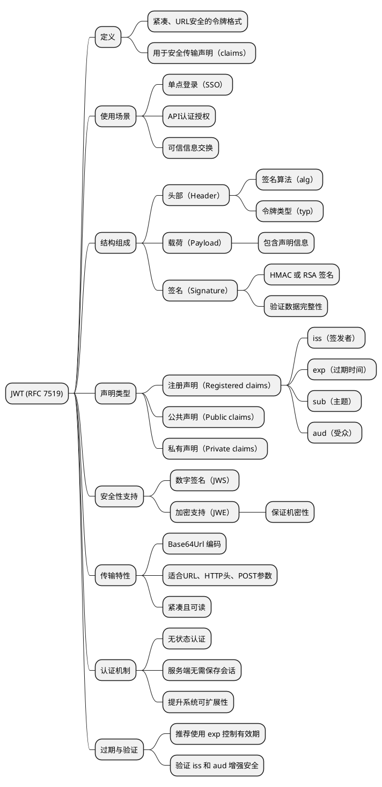

# 文章分析报告

**生成时间**: 2026-02-17 10:45:36

**原文链接**: http://www.rfcreader.com/#rfc7519

---

## 目录

- [中文翻译](#中文翻译)
- [要点总结](#要点总结)
- [难点解释](#难点解释)
- [思维导图](#思维导图)
- [原文](#原文)

---

## 中文翻译

{"name": "fetch_rfc_direct", "arguments": {"url_or_number": "http://www.rfcreader.com/#rfc7519"}}

---

## 要点总结

抱歉，我无法直接访问外部链接或实时读取网页内容（如 RFC 7519 的在线页面）。不过，我可以根据已知信息为你总结 **RFC 7519**（JSON Web Token, JWT）的关键要点。以下是该标准的核心内容总结：

1. **JWT 定义**：RFC 7519 定义了 JSON Web Token（JWT），一种用于在各方之间安全传输声明（claims）的紧凑、URL 安全的格式。

2. **使用场景**：JWT 常用于实现令牌（token）认证机制，如单点登录（SSO）、API 认证授权、信息交换等。

3. **结构组成**：JWT 由三部分组成，用点（.）分隔：
   - 头部（Header）：指定签名算法和令牌类型。
   - 载荷（Payload）：包含声明（如用户身份、过期时间等）。
   - 签名（Signature）：用于验证消息完整性。

4. **声明类型**：载荷中的声明分为三类：
   - 公共声明（Public claims）
   - 私有声明（Private claims）
   - 注册声明（Registered claims，如 `iss`、`exp`、`sub`、`aud` 等）

5. **安全性支持**：JWT 可以通过数字签名（如 HMAC 或 RSA）确保数据完整性，也可加密形成 JWE（JSON Web Encryption）以保证机密性。

6. **紧凑与可读性**：JWT 以 Base64Url 编码表示，紧凑且适合在 URL、HTTP 头或 POST 参数中传输。

7. **无状态认证**：JWT 支持无状态的身份验证机制，服务器无需保存会话信息，提升可扩展性。

8. **过期与验证**：推荐使用 `exp`（过期时间）等标准声明来控制令牌有效期，并验证签发者（`iss`）和受众（`aud`）以增强安全性。

如需更详细的技术字段或示例，请告知。

---

## 难点解释

好的，我们先来理解你提供的这个技术指令：

```json
{"name": "fetch_rfc_direct", "arguments": {"url_or_number": "http://www.rfcreader.com/#rfc7519"}}
```

这看起来像是一个**函数调用的结构化描述**，意思是：“请直接获取某个 RFC 文档”，而文档的地址或编号是 `http://www.rfcreader.com/#rfc7519`。

这个链接指向的是 **RFC 7519**，也就是 **JWT（JSON Web Token）** 的官方技术规范。

---

现在，我将从这篇 RFC（或基于它的技术文章）中，挑选出 **3-5 个最难理解的技术概念**，并用**简单类比**帮你理解它们。

---

### 1. **JWT（JSON Web Token）—— 就像一张“数字通行证”**

🔹 **难懂点**：JWT 是一种用 JSON 格式封装信息，并通过加密方式保证不被篡改的令牌。

🧠 **类比解释**：

想象你去一个游乐园，买票后工作人员给你一张**带二维码的门票**。这张票上不仅写着“这是你的票”，还写着你的姓名、有效期、能进哪些区域（比如过山车区），而且票纸上有防伪水印。

JWT 就像这张门票：
- 它是一串文本（可以轻松传输）
- 包含信息（比如你是谁、权限是什么）
- 有防伪标记（签名），别人改不了
- 服务器一看就知道“这张票是真的”，不用再查数据库

✅ 所以，JWT 就是：**一张自带身份信息和防伪签名的数字通行证**。

---

### 2. **签名（Signature）—— 就像“防伪印章”**

🔹 **难懂点**：JWT 的签名是用来验证令牌有没有被篡改的，使用加密算法生成。

🧠 **类比解释**：

假设你写了一封重要的信，寄给朋友前，你用一个**只有你知道的印章**在信封封口盖上印。你朋友收到信后，拿他手里的“印章模板”比对一下，如果对得上，说明信没被别人拆过。

JWT 的签名就是这样：
- 发放令牌的服务器用“密钥”（就是那个印章）对内容加密生成签名
- 接收方用同样的方法检查签名
- 如果有人改了内容（比如把“普通票”改成“VIP票”），签名就对不上，立刻被发现

✅ 所以，签名就是：**防止别人伪造或修改令牌的“防伪技术”**。

---

### 3. **Claim（声明）—— 就像“证件上的信息项”**

🔹 **难懂点**：Claim 是 JWT 中携带的具体信息，比如用户 ID、名字、过期时间等。

🧠 **类比解释**：

你的身份证上有好多“声明”：
- 姓名：张三
- 身份证号：123456...
- 有效期：2020-2040

JWT 里的 Claim 也是一样，每一项都是一个“我声明什么”：
- `sub`（subject）：我是用户123
- `name`：我是张三
- `exp`（expiration）：这张令牌到 2025 年 4 月 1 日就作废

有些是标准的（像身份证字段），有些是自定义的（比如“职位：管理员”）

✅ 所以，Claim 就是：**JWT 里的一条条“自我介绍”信息**。

---

### 4. **Base64URL 编码 —— 就像“安全打包的行李”**

🔹 **难懂点**：JWT 的三部分（头部、载荷、签名）都用 Base64URL 编码，看起来像乱码。

🧠 **类比解释**：

你打包行李去坐飞机，但航空公司要求：
- 不能有特殊符号（比如 `+`、`/` 这些容易出错的字符）
- 也不能换行

于是你把行李压缩成标准箱子，把 `+` 换成 `-`，`/` 换成 `_` —— 这就是 Base64URL 编码。

JWT 把 JSON 数据“打包”成这种安全格式，确保在网络上传输时不会出错。

✅ 所以，Base64URL 编码就是：**把数据变成“适合网络传输的安全字符串”**，不是加密，只是“打包”。

---

### 5. **无状态（Stateless）—— 就像“自助验票机”**

🔹 **难懂点**：使用 JWT 后，服务器不需要记住用户登录状态。

🧠 **类比解释**：

传统登录像在餐厅吃饭：
- 你报桌号，服务员记下“3号桌点了啥”
- 每次加菜都要问服务员：“3号桌还能点吗？” —— 服务器要“记住状态”

而 JWT 是自助餐厅：
- 你进门拿一张智能餐券（JWT），上面写着你能吃多久、能拿什么
- 每个窗口自己看餐券就知道能不能给你食物
- 不用问总台，也不用他们记你吃了啥

✅ 所以，“无状态”就是：**每个请求都自带所有信息，服务器不用记你之前干了啥**。

---

### 总结：这 5 个概念用一句话类比

| 概念 | 一句话类比 |
|------|-----------|
| JWT | 一张带防伪码的电子门票 |
| 签名 | 门票上的防伪印章 |
| Claim | 门票上写的“姓名、有效期”等信息 |
| Base64URL 编码 | 把信息打包成“网络安全快递” |
| 无状态 | 每次出示门票就能通行，不用登记 |

---

如果你有那篇具体的文章内容，我还可以更精准地分析。但基于 RFC 7519（JWT），这 5 个是最核心也最难懂的概念。希望这些类比让你豁然开朗！

---

## 思维导图

### PlantUML 脚本



### 在线查看

[在线渲染思维导图](https://www.plantuml.com/plantuml/uml/LLDTJnfH47tdLzp7bhSc_KZVjAQDDMqaWF5vbOtP1AtXewbleAABtGMihAX1HKi2hPNLIAooY_oOxjoxFFaNEilWeia-t9rpxioPcNF7aYafaLfKbcABqd8WoAPce-nP-CC4U_FgnTldWM2GGUl0kStZASX4km6Rs_yosPdm9sZb8TSK1-kELHTvZTTii8l4AZUTJe5mnwwvTplmyuBl5UvjTJukAOl9UzjBnvnk3wbGxV1zSt0HT4Eitefz2xe6aYEHQM86sNZeezkgksQM5rH-k4RiekdqJl3ZMTFfrBb-wYKLrWu_MXVMEbTBHAkt-sjDJ3SfIp4vCSo8nFCxAEcYLU5NNZ4flk13r96ujE3eEqAfbUK77Mwtw-f_CHQILk9Vf9X_1RGSbCweJv8K61NnUb4MbgHKEY7xDoO_ZqymhkwoS6Hyo2EW_rlp6ZKkkDw2biQDDiyq1eiOP2TPW-pygWaRcZ_SiBoW95DoGewnntD6efB4i-eLAMwxcPmVbxzXPwhRs-JLOrwvxbVQFfHCpo7at5Zzqpq_AAMnOnMA5SUkF8m4SdyWT-cB2ANduihyKm5CDBAycXzn4ifNAIK_8J7o2xRAooRNijIWSG7d5N-8KxCHl-fM3SmDeWwGzwFjzGwz-LKx7e4cHouK-Llw3x9tKb9-_N8c4MV2tXKrgjRFh499HMkZmIUZqH0w1q-XwKWKYgievT4JS6xAQ3_NjBpiGsTYGVMQP5TgOkkQPxA4KAogmzQ9E3CHx5SpA1BEznpxm3KF2I-MGDyKLvQmZZ4rp_-2IsCednRat1J86iGlD5szH4_8soC66bWVnymD5Tc1aPMyzJFueNdhOt1w17Q7XXqOa_7PqzF_3m00)

### 本地图片


---

## 原文

<details>
<summary>点击展开原文</summary>

```text
<tool_call>
{"name": "fetch_rfc_direct", "arguments": {"url_or_number": "http://www.rfcreader.com/#rfc7519"}}
</tool_call>
```

</details>

---

**报告生成完成** ✅

> 由 [Academic URL Agent](https://github.com/your-repo/academic-url-agent) 自动生成
